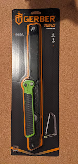
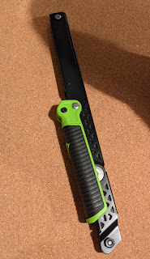
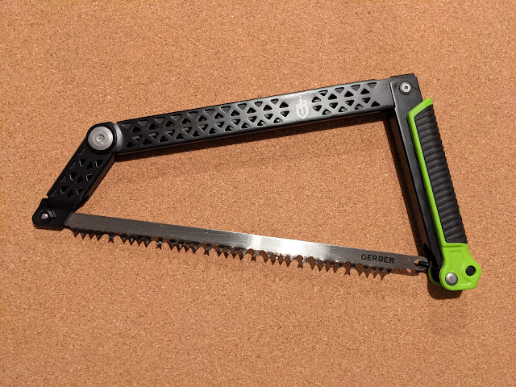

---
title: "Готуй воза взимку"
date: "2020-12-12T17:00:00.001Z"
categories:
    - blog
tags:
    - imported
---

 Зате оця ось покупка цілком обміркована і неквапно чекала своєї знижки у амазонівському списку.

Помахавши влітку сокирякою і зрозумівши, що рубати дерева впоперек не найвдячніша справа \- я вирішив розоритися на пилку. Звичайно ж, для кемпінгу хотілося портативну і складану, хоча возити у машині можна і звичайнісіньку ножовку, але ж воно не по фен шую. 

Знижки на Амазоні я так і не дочекався, та знайшлася на цілих $5 дешевше в Home Depot. Я все укріплююся в думці, що хороші речі не продаються за третину ціни, хоча звичка і внутрішній гасконець час від часу вимагають дешевизни і халяви.

Так чи інакше, пилка куплена, приїхала \- і поклалася на поличку, чекати свого часу навесні.

  
  
  
  
