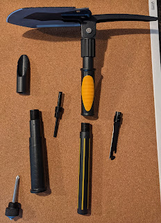
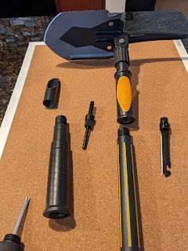
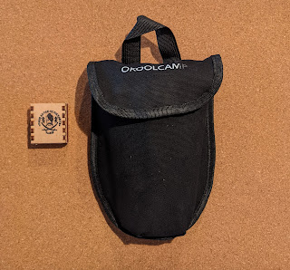

Відсутність снігу у місцевих краях трошки розслабила, але так негодиться, тому у багажник була врешті-решт куплена лопата.
<!--more-->

Цього разу замість Фіскарсу я віддав перевагу чуду китайської промисловості - три секції, що поєднуються різьбою - трошки довго збирати, натомість із дуже компактної торбинки можна стулити більші ніж півметровий інструмент. Та який інструмент!

На додаток до самої лопати від щедрих китайців ми отримуємо:

- склобій
- викрутку - шліц і філіпс
- огниво
- свисток
- гарпун
- пилку
- ножичок
- гвоздодьор
- альпеншток (чи як назвати гостряк, протилежний до лопати)

Сама лопата також має додатковий функціонал - одна грань заточена, інша - пилка, та два отвори під гайки, і звичайно - відкривашка для пива! Ну і лопату можна зафіксувати як лопату, а можна - під прямим кутом, як мотику.

Звісно, це навіть не близько до тої продуманої модульності, яку має рішення ["Вій"](https://dobryi.in.ua/lopatka-sokira-viy-green-apples/) від [Сергія Вовкулаки](https://dobryi.in.ua/avtonabir/), але за відсутності вітчизняного шедевру - доводиться жувати, що дають.

Тепер чекаю нагоди опробувати на кемпінгу!  

  
  
  
