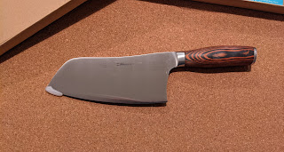
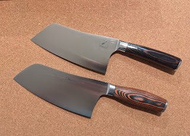

---
title: "Ніж для польової кухні"
date: "2021-02-09T16:00:00.001Z"
categories:
    - blog
tags:
    - imported
---

 Надихнувшись гурманістичними ідеями, культивуючи ідею величі кулінарної касти... або, чесніше кажучи, надивившися інстаграму поляків із Ірландії, купив і собі ножичка, аби готувати на природі.

Вибір між двома склався на користь першого \- банально через ціну, бо різниця вдвічі. Два покищо не треба, а для початку навчуся вправлятися із тим, що є, а далі буде видно.

Тепер би ще придумати, чим та як його гострити....  
  

    
 UPD: Додаю посилання на Амазон  
[Перший ножик](Mueller 7-inch Cleaver Knife, Vegetable Meat Chinese Chef’s Knife, German Stainless Steel with Ergonomic Pakkawood Handle, for Home Kitchen and Restaurant by Commerce Planet Learn more: https://www.amazon.com/dp/B08BX7136Z/ref=cm_sw_em_r_mt_dp_QJC62R5JA1AM4TT900Q7?_encoding=UTF8&psc=1) (коричнева ручка, дешевший)  
[Другий ножик](https://www.amazon.com/dp/B08KD27THM/ref=cm_sw_em_r_mt_dp_7D7VZHEM5XJ8WZ7G56QN?_encoding=UTF8&psc=1) (темніша ручка, дорожчий)   
   
  

