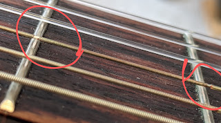
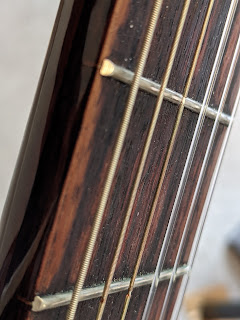

---
title: "Практика струн: потрібен повтор"
date: "2021-02-10T05:30:00.001Z"
categories:
    - blog
tags:
    - imported
---

Пройшло менше року (липень\-лютий: близько 8 місяців) від [заміни струн](https://p.disfinder.com/2020/07/blog-post.html) із "які були" на ямахівські NS 110\. Через півроку неінтерсивного бренькання новісінькі струни вже виглядають так:

   
  
Обмотка четвертої струни перетерлася мінімум в двох місцях, обмотка п'ятої помітно покоцана напроти пари порожків.    
Не думаю, що міняти одну струну то вдала ідея, тому як знайдеться час та натхнення \- проведу другу операцію пересадки на інший комплект.   
   

