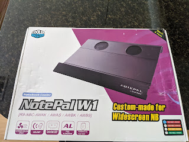
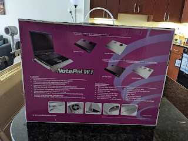
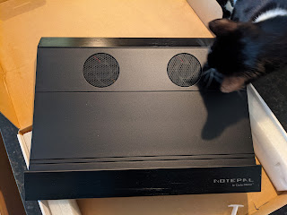

---
title: "Дні Канади, завершення."
date: "2021-02-21T17:00:00.007Z"
categories:
    - blog
tags:
    - imported
---

Тренд щодо "Днів Канади" народився в моєму [алко\-бложику](https://t.me/gramm330), і я все намагався згадати, що ж іще канадського за останній місяць (на додачу до пива і віскі) я забув, аж ось воно.

Почав грітися ноутбук, я (повторно) замінив термопасту (і може заміню ще раз, та замість доставленої із Латвії КПТ\-8 візьму щось модерновіше) \- почав думати про охолоджуючу підставку. Подивившись на Амазоні, я дуже розстроївся і засумував за своєю старючою **Notepal** від Cooler Master \- вона була суцільним шматком залізяки (алюмінію?) із двома вентиляторами та приємним "зубчиком" внизу під зап'ястками \- зручніше положення рук \-\> зручніше друкувати. На жаль, її знайти не вдалося (вже давно не продають). Обрав собі щось навмання (із популярних) за \~$20, приїхало пластмасове решето, прогинається, вентилятор шумить, вимикається лише фізичним відключенням ЮСБ. Повернув назад, і вже почав морально дозрівати на якусь мажорну підставку за $50\-$80, аж як ностальгічний пошук по картинкам вивів мене на сайт канадійського магазину, в якому той самий Notepal продавався за 11 CAD немов привіт із 90х, вартість доставки вдвічі перевищувала ціну виробу, але журба за добре знайомою підставкою (яку я, здається, продав за ₴100 при виїзді) затьмарила розум і я зробив замовлення. 

Всупереч очікуванням, сайт і магазин виявилися робочими, замовлення прийняли, гроші списали. Мої сподівання були песимістичними \- від підозри, що це неробочий сайт\-привид, що застряг у тому давньому минулому, я перейшов до думки, що просто немає цього товару, хоча і заявлено що є. Однак за пару днів прислали емейла із трекінг\-номером, а ще за декілька днів прийшла і сама посилка. Власне, ця посилка і завершує ті самі "дні Канади" \- підставка приїхала, я щасливий, хотілося би написати \- ноутбук холодний, але ніт, все одно гріється, та я вже настільки в приємному пост\-катарсисі від успішної "авантюри", що на це не зважаю %\-)

UPD: поліз на сайт аби додати ссилку в пост \- і побачив, що після моєї покупки підняли ціну до $28! Я так дивлюся, ріст інвестицій вийшов краще, аніж в біткоїнах, \+200% за пару тижнів ))  

   

  
  
  
  
   

