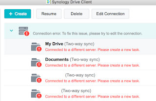

Не пройшло і півтора роки із моменту, як я став щасливим власником [домашнього сервера](/posts/2019/12/04) від Synology, як прийшов йому гаплик.
<!--more-->
Почну зі спойлера - гаплик не абсолютний, і дані цілі. А от сам сервер - не дуже.

## Загадковий писк

Симптоми почалися із нерегулярного разового писку динаміком, десь раз на кількадесят хвилин - я навіть спершу думав, що то не в мене пищить. Через кілька таких писків сервер пікнув інакше і пішов в ребут. Довго поблимав своєю синьою лампочкою на кнопці живлення, включився - та замість веб-консолі управління показав дулю у вигляді веб-консолі початкової ініціації самого сервера.

Спершу я добряче перелякався, вимкнув, розібрав, почистив пиляку, погуглив. Нагуглив, що через фізичний недолік у кнопці хард-ресету (така втоплена в корпус, нажимається розігнутою скріпкою, є в багатьох роутерах і робить десь те саме - стирає внутрішню прошивку девайсу) ця кнопка спрацьовує і перетирає сервер. Дані типу цілі. Але деякі користувачі звітували про нескінченний ресет - щоп'ятьхвилин.

  

## Відновлення

Я покрехтав, зібрав почищений сервер, ініціалізував - отримав голу коробку майже без нічого, лише з файловими шарами. Ані Plex, ані Gitlab сервер на докері, ані Synology Drive - нічого немає, як немає і моїх юзерів та налаштувань. На щастя, я знайшов досить старенький бекап конфігурації - відновив його - з'явилися юзери. Поставив Plex та Drive - плєкс одразу знайшов всю свою попереднью базу фільмів, а Драйв - усі папки. Ноутбук синхронізував папкочки заново - працює.

Однак, поки я перераховував нову сивину - сервер запищав знову, і знову,  і знову перезавантажився. Із тим самим результатом - внутрішня "ОС" стерта. Автоматизується це чудо досить куцо, тож знову - 10 хвилин установки через веб, потім ручне відновлення настройок і пакетів - працює.

## Заміна

Попрацювало воно так пару днів, після чергового перезавантаження я махнув рукою і встановив тільки Плєкс (все ж, всі важливі документи в мене є ще в декількох місцях, то найбільше місця на сервері займає саме медіа), а після ще одного резету - вимкнув. На той час я вже написав у підтримку виробника, як радили в інтернеті - і вони запропонували безкоштовну заміну. Якщо я спершу шлю їм дефектний модуль, а потім вони мені робочий - то зовсім безкоштовно, а якщо навпаки (спершу вони мені шлють новий, а я вертаю брак) - то треба кредитку, на якій вони блокують ціну модуля, і повертають гроші по отриманню дефектного.

Отже, чекаю прибуття замінника, буду перекидати диски та сподіватися, що на цей раз буде краще, ніж попередній. Сказати, що я розчарований - це нічого не сказати. Домашній NAS/multimedia в тому чи іншому вигляді в мене вже більше 10 років. До цього я користувався неттопами (ZOTAC ZBOX та Intel NUC) зі звичайним ноутбучним вінчестером всередині і банальною убунтою на борту - і не мав проблем. Зараз же в мене вже тиждень стоять "мовчки" три диски на 12 терабайт сумарної ємності - і я не можу ними скористатися, бо, курво, якась мікрокнопка десь там шось витирає!

Безкоштовна заміна по гарантії - то хоч щось, але ж даунтайм, втрачені нерви та ще і на зворотню пересилку доведеться баксів 10-20 витратити...

Добре, хоч самі диски із даними цілі. Схоже, пора таки доробити бекап у `AWS Glacier`, та заодно подумати і про резервний NAS....

## Update 2024

А що і як я вирішив бекапити (та чи є резервний нас) - можна почитати на окремій сторінці [проекту про бекапи](/docs/projects/backup/)
