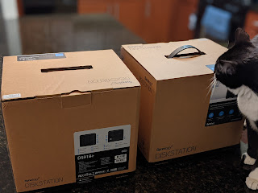
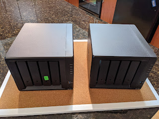
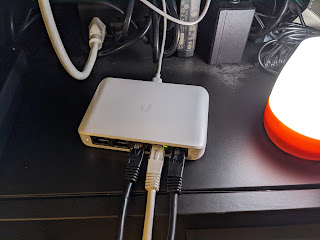
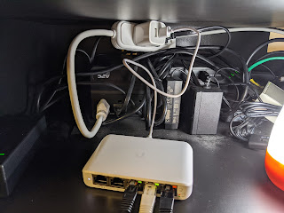

Приїхала заміна Synology. Переставив диски, заодно докинув 4Гб пам'яті, що все одно валялися в шухлядці - стало 8. Plex завівся швидко, конфігурацію теж відновив, тонкий тюнінг - по ходу справ.
<!--more-->

Позаяк все одно поліз у тумбочку, в якій сховано кабелі - вирішив все ж задіяти гігабітний Ubiquity свіч, що вже кілька місяців валяється. Я брав саме його, бо він має PoE IN, а мій роутер - PoE OUT, а всі розетки у UPS вже зайняті. Однак через якісь невідомі мені причини, включатися через ПоЕ свіч відмовився, хоча роутер справно рапортує у інтерфейсі, що девайс-реціпієнт знайдено і струм увімкнено. Знайшов у шухляді короткий подовжувач та ЮСБ-зарядку на два виходи - тепер в мене на один порт в UPS включено телевізор і свіч. Ну тепер ті нещасні два моїх девайси, в яких є гігабіт - зможуть пінгувати одне одного швидше.

  
  
  
  
