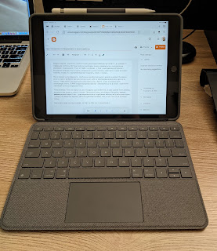

Коротка замітка - поки Еппл телиться із випуском нових Макбуків про на М1Х - я страждаю зі стареньким лептопом 2013 року випуску, який щось погано справляється із сьогоднішніми викликами - відеодзвінок у Тімс чи Скайп, а особливо - у Зумі із накладенням віртуального бекграунду потрошку його плавить, незважаючи на двічі замінену термопасту (і може ще втретє поміняю, хтозна). Та і звичайний браузінг тормозить, тупить і глючить.
<!--more-->

Тож я подався на експерименти - пробую всю неробочу активність робити на айпаді. Поклавши руку на серце і зробивши виключення для такого хобі, як програмування (все одно зараз не до цього) - окрім роботи мені від компʼютера треба не так і багато - вікно в інтернет, ютуб, месенджери, пошта. Та 90% потреб перекриває браузер - починаючи від тої ж пошти і закінчуючи платежами за послуги/кредитки/тощо.

Чому на айпаді? Тому що перед тим, як я подарував один любій тещі, я дуже зацінив якість девайсу, купленого при нагоді на чорну пʼятницю. Прекрасний екран, довготривала батарейка, анальне рабство радощі сінергії Еппл - дуже вирізняються від Андроїдових таблетів, які у моїх руках тільки і робили, що вимагали зарядки. Айпад же працював тижнями, хоча я тоді тільки ютуб за обідом тупив.

Цього разу я взяв теж простенький - не Ейр і не Про, але із клавіатурою (та стілус лишився від попереднього) і осьо два тижні поспіль поки переконуюся в успішності такої ідеї. Я отримав безшумний малесенький компʼютер із тачскріном, який може бути планшетом, на якому працюють в цілому ті ж самі хоткеї/жести, що і на великому та який справляється із переважною більшістю повсякденних задач.

Почитати книжку, послухати подкаст, покерувати колонками, почитати робочу пошту та тімс, почитати неробочі та робочі скайп-слак (і пописати, за потреби), оплатити рахунки, потупити в ютуб чи фейсбук, послухати щось на курсері, ЕдЕксі чи Юдемі, провести сеанс відеозʼязку із друзями - поки політ нормальний. А, іще однієї зарядки цього компʼютера вистачає на декілька днів…

Що він мабуть не вміє - це підключати зовнішні девайси типу жорсткого диску. Але на щастя, у Сінолоджі для IOS є клієнт - то ж мої файли я отримую просто по повітрю. З часом ще спробую налаштувати SSH клієнт, і тоді можна буде щось робити і із серверами.

Поки за два тижні знайшлася єдина дошкульна відмінність - тутешні браузери не вміють налаштування проксі, це системна настройка. Тому завернути один браузер як мені треба, а інший напряму - не вийшло. До того ж, налаштування SOCKS проксі взагалі нема, хоча я і нагуглив хак, як то можна зробити. Але це поки не критична необхідність, потреба в тому все одно бувала раз на пару тижнів, то ж можна і до ноутбука дотягтися.

Щож, експериментую далі.

