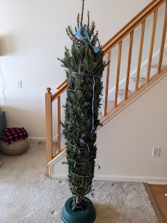

---
title: "Готувались сані влітку"
date: "2021-12-17T06:33:00.003Z"
categories:
    - blog
tags:
    - imported
---

 Хто в кінці лютого купує підставку для ялинки \- той я.

Адже попереднью підставку я, помучившися пристойно над збиранням \- викинув разом із ялинкою. Провів певні дослідження ринку, і виявилося, що є значно кращі варіанти \- отака крутезна штука із педалькою, яка фіксує деревину просто і надійно.   
Однак на той навколоріздвяний час воно коштувало \~$80, що мені здавалося забагато навіть за дуже хорошу підставку. Тому я підписався на моніторинг цін \- і коли прийшло повідомлення, що є ось така беушна за двадцятку \- купив не роздумуючи. Врешті\-решт, 60 долярів знижки \- за це я можу потерпіти порвану коробку та трошки минулорічних голочок.  

  
Ця штука (а заразом і оцей пост) лежали собі із самого літа, аж доки прийшов їх час. Що я скажу \- це найзручніша тримачка для ялинки, яку можна собі уявити. Дерево вставляється, кілька рухів ногою \- вуаля, готово. Виявляється, притис мотузку \- дві хвилини і ялинку дістато, мотузку обрізано, ялинку зафіксовано.  
Заніс в дім \- видно, що стоїть криво. Знову 10 секунд, dismount, mount \- всьо.   
Німецька інженерія, хай їй дасть бог здоров'я і прибутків.

  
  

