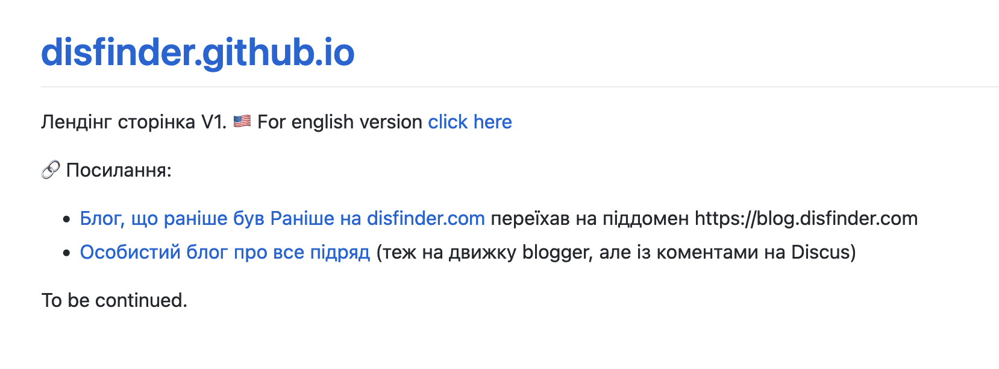

## Преамбула

Чомусь захотілося до кінця 2023 року переробити свій сайт - якщо до цього він містив просто контент мого блогу (одного із), захотілося переробити його в "типову" заглушку - невеличку статичну сторінку (чи набір сторінок) - із набором потрібних посилань на блоги, на статті, може на профіль гітхаба чи лінкедин і всяке таке.  
Чим же можна це найкраще захостити? Звичайно ж, GitHub Pages - пишеш собі маркдаун, пушаєш його в репозиторій, гітхаб робить свою магію - і вуаля, сайт готовий.  
Мінімум зусиль, максимум результату, тим більше, що власне https://disfinder.github.io вже певний час як існував та хостив всілякі замітки, що я їх робив сам для себе.
<!--more-->
## Лендінг V1

Сказано - зроблено!
Похєривши (попередньо забекапивши) що там було на GitHub Pages, поколядувавши трошки у панельці хостингу із налаштуваннями DNS - виявилося не так складно натравити свій домен на сторіночку Гітхабу. Виглядає досить бідненько, але для початку згодиться.



## Окей, але ж давай повернемо сюди статті

Ще досить давно я схилився до думки, що блог та дописи у ньому - добре підходять для повідомлень про якусь подію, про щось, що мало місце у певний час:

- "Охохо, [дивіться, я вчергове переїжжаю - із tumblr на blogger!](blog.disfinder.com/2012/09/blog-post_1875.html)
- [Упс, у мене зламався сервер...](https://p.disfinder.com/2021/02/blog-post_22.html)
- [Сьогодні я подумав, що писати статті краще в гіт, а не в блог](https://p.disfinder.com/2021/12/blog-post.html)

А от для якогось значущого шматка інформації - ну от як той приклад із [списком книг та статей, що я наполегливо рекомендую для ознайомлення](/docs/articles/must-read/) - то не дуже зручно мати це за допис у блозі від якогось лохматого [2012-06-4], давати на те посилання та оновлювати/доповнювати допис.

## Окей, GitHub Pages наче як створені для статей

Давайте розбиратися.  
Під капотом у GitHub Pages - такий собі [Jekyll](https://jekyllrb.com/) - як вони стверджують,
> Simple Static Blog-aware

Окей, гітхаб... ["Осьо як додати темку до вашого сайту за допомогою Jekyll](https://docs.github.com/en/pages/setting-up-a-github-pages-site-with-jekyll/adding-a-theme-to-your-github-pages-site-using-jekyll)

>If you want to preview your changes first, you can make the changes locally instead of on GitHub. Then, test your site locally.

Добре, читаємо [Testing your GitHub Pages site locally with Jekyll](https://docs.github.com/en/pages/setting-up-a-github-pages-site-with-jekyll/testing-your-github-pages-site-locally-with-jekyll)

> Before you can use Jekyll to test a site, you must:
>> Install Jekyll.
    Create a Jekyll site. For more information, see "Creating a GitHub Pages site with Jekyll."
>> We recommend using Bundler to install and run Jekyll. Bundler manages Ruby gem dependencies, reduces Jekyll build errors, and prevents environment-related bugs. To install Bundler:
>> Install Ruby. For more information, see "Installing Ruby" in the Ruby documentation.
    Install Bundler. For more information, see "Bundler."

Тобто, щоб написати в бложик, мені треба:

- поставити рубі
- поставити якись там Bundler
- поставити Jekyll за допомогою цього bundler'a

Якось задофіга, сказав собі я, але ж треба спробувати. Хоча і не хочеться звʼязуватися із рубі.

## ...but the hedgehog can never be buggered at all

```shell
$ gem install bundler
ERROR:  While executing gem ... (Gem::FilePermissionError)
    You don't have write permissions for the /Library/Ruby/Gems/2.6.0 directory.
```

Але бандлер в мене є - неясно тільки звідки, може системний.
окей, що там далі по квесту?

```shell
$ bundle init
$ bundle config set --local path 'vendor/bundle'
$ bundle add jekyll # цуко, ігнорує попередьно встановлене налаштування про local path, Ctrl-C
$ bundle install --path vendor/bundle
$ bundle exec jekyll new --force --skip-bundle .
bundler: failed to load command: jekyll (/Users/disfinder/tmp/jekyll/vendor/bundle/ruby/2.6.0/bin/jekyll)
LoadError: cannot load such file -- google/protobuf_c
```

wump-wump-wump...  
Приїхали.  
Але я не відразу здався - лише погугливши іще із пару годин та остаточно заляпавшись у ці рубішні штучки по самі лікті, я врешті вирішив, що принаймні своїм власним вибором я не мушу підтримувати це гівно і краще оберу щось інше.  
І пішов собі спати.

## Альтернативи

Так як страшненький сайт свербів і чесався, то довелося продовжувати пошуки, щоб таки закрити цей гештальт - треба ж відновити свої безцінні статті, та і нову для [Тівасика про Syncthing](https://blog.tivasyk.info/blog/2023/12/10/docker-migration.html#comment-6351525823) треба ж якось написати.

Швидкий гугльож видав декілька кандидатів:

- [hugo](https://gohugo.io/)
- [gitbook]
- [Eleventy]
- "[Gatsby] is great but you need to know React" - дякую, але ні
- навіть [codeberg](https://tonisagrista.com/blog/2022/codeberg-setup/) порадили

Щож, спробуємо розпочати із Hugo...

## Перший досвід

```ruby
    brew install hugo
```

І все, і все працює, і ніякого секаса із депендесі/джемами і іншими загадковими копролітами...  
Ось вона, магія Go в дії!  
Що далі?

```shell
$ hugo new site .
$ hugo new site . --force
$ hugo new content docs/home.md
$ hugo server --buildDrafts
    Built in 31 ms
    Environment: "development"
    Serving pages from memory
    Running in Fast Render Mode. For full rebuilds on change: hugo server --disableFastRender
    Web Server is available at http://localhost:1313/ (bind address 127.0.0.1)
    Press Ctrl+C to stop
```

Вау, магія - відкрив браузер і все працює!  
Вйо читати документацію!

## Міграція Github Pages на Hugo

Окей, щоб навчити Гітхаб використовувати Hugo замість того доктора Джекіла - у Хʼюго навіть є [документація](https://gohugo.io/hosting-and-deployment/hosting-on-github/), перші кілька кроків із якої я вже маю.  
Все, що треба зробити - то переключити побудову репозиторія на GitHub Actions в розділі Pages в налаштуваннях, і закомітити файл із workflow - це ж дрібниці, благо, із Actions я свого часу трошки познайомився.

### Обираємо та встановлюємо тему

Мені сподобалася оця [книжна тема](https://themes.gohugo.io/themes/hugo-book/), але як справжній параноїк - я вирішив що варто [її клонувати](https://github.com/disfinder/hugo-book)

```bash
git submodule add https://github.com/disfinder/hugo-book themes/hugo-book
```

### I18N

Одразу зробимо сайт мульти-мовним для наших англомовних друзів. То й що, що англійська версія буде порожньою? Я туди колись резюме покладу.  
Зате відразу посилання всі будуть як треба, і не доведеться воювати із побитими ссилками пізніше.

## Outro
Що залишилося?  
Додати disqus ідентифікатор і запостити все це добро.  
Якщо ви читаєте цю статтю - значить, в мене таки вийшло.  
Алілуйя.
