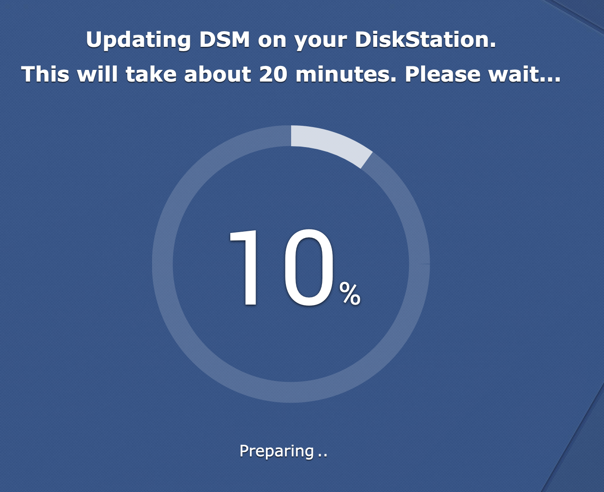
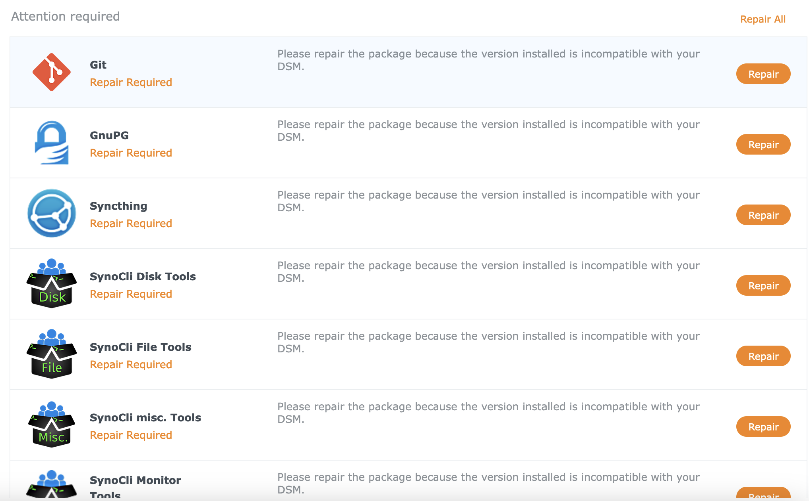
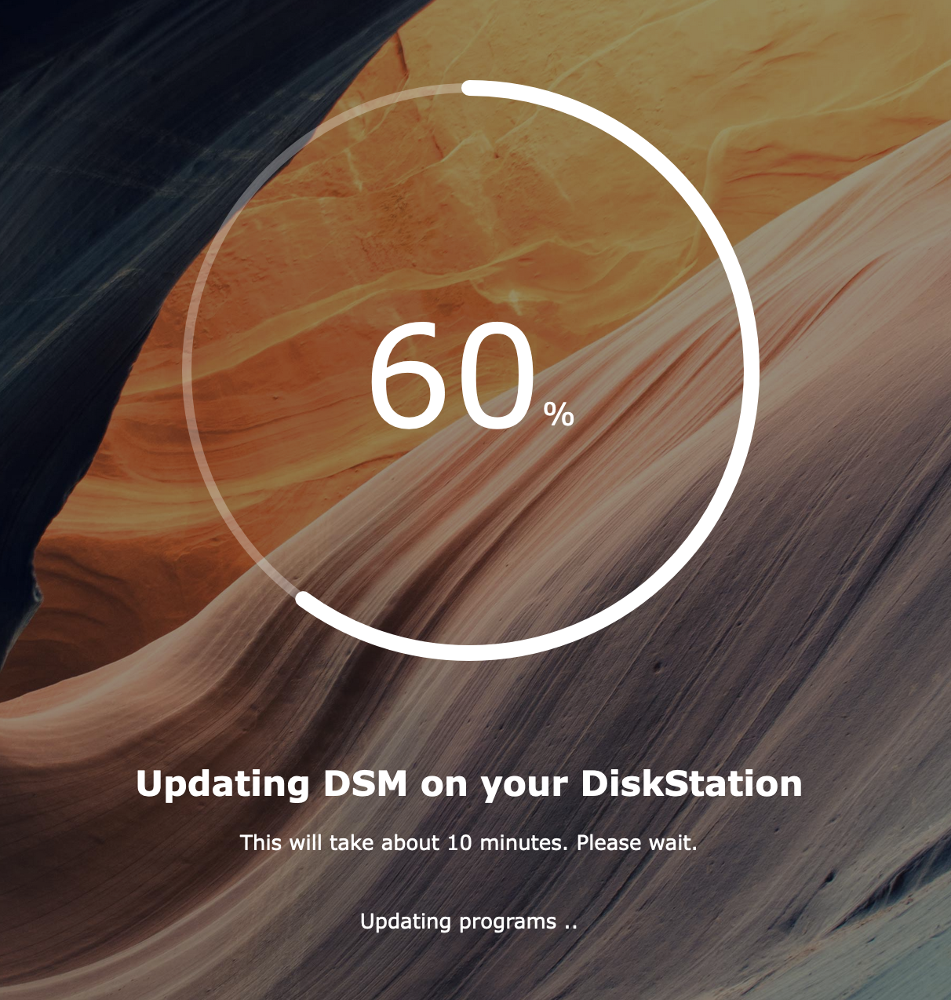
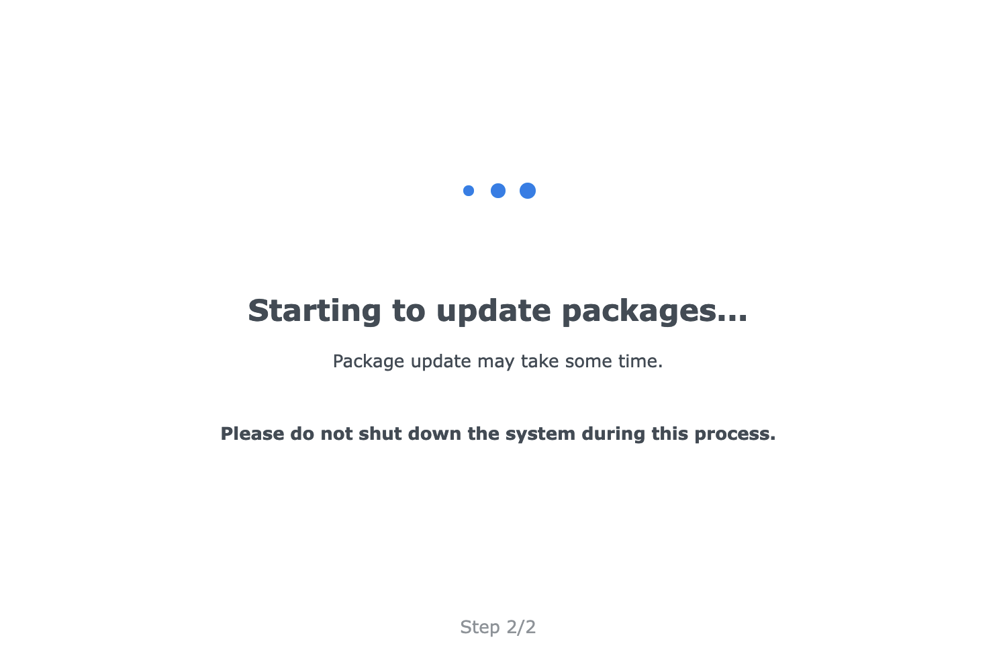
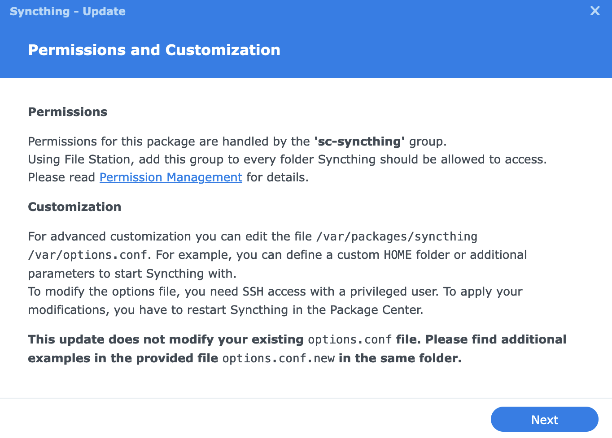
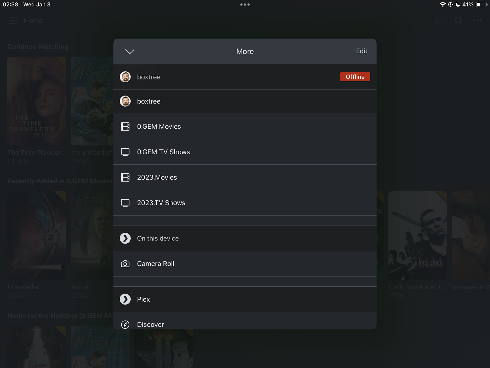
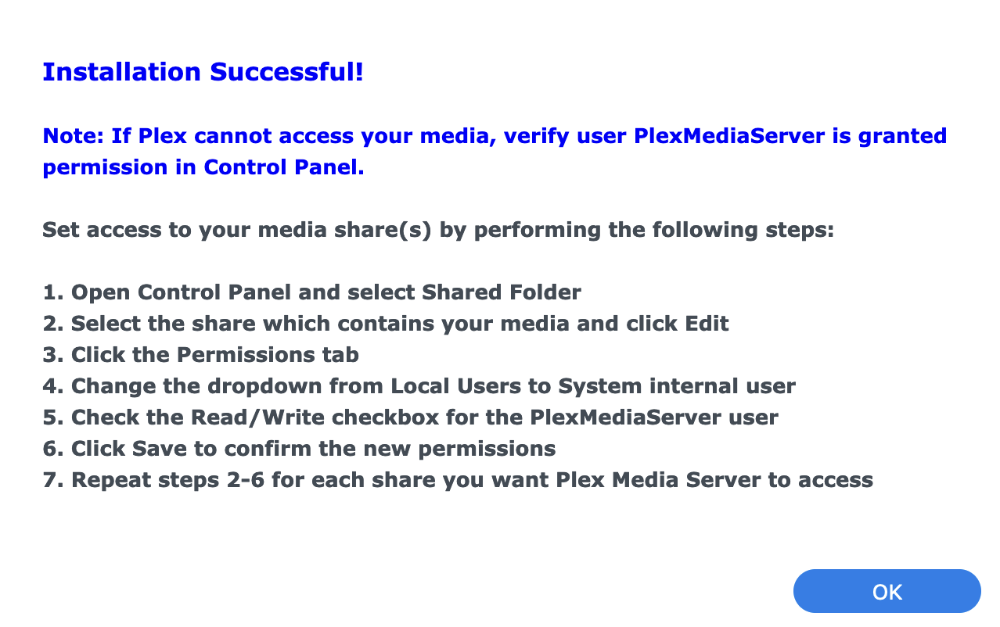
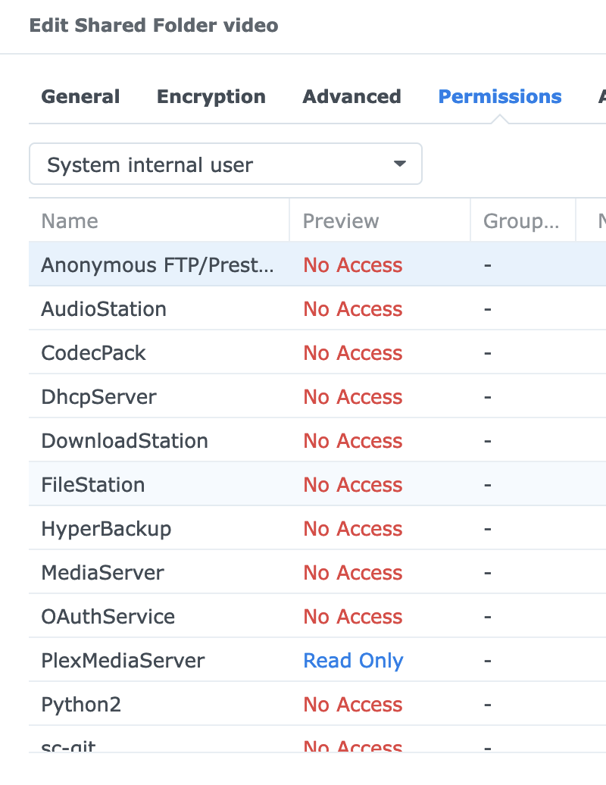

## Lets get the party started

Як іще відсвяткувати новий рік, як не мажорним оновленням серверної ОС [домашнього сервера](https://p.disfinder.com/2019/12/nas.html)?
<!--more-->
Я в принципі невеликий любитель мажорних оновлень, особливо що стосується всяких
системних компонент - по принципу "працює - не чіпай", бо я ж не із системою працюю, 
а із апплікухами - от їх оновлювати ок.

Але коли [виробник анонсує кінець підтримки](https://www.synology.com/en-global/products/status/eol-dsm62), то рано чи пізно оновитися доведеться.  
І тоді в дію вступає інше правило - краще оновитися раніше, поки ще в інтернеті не протухли статті як фіксити ті чи інші проблеми переходів із одних мажорних релізів на інший, ну і поки взагалі різниця не набігла настільки велика, що ніяких тестів апгрейду із 6.2 до 49.155 не проводилося.

Тобто, раз вже доведеться, то чому би не зробити це зараз?  Так як лінукс у мене не справжній, тикаємо кнопку "Оновити"...




## ... і приїхали

Практично кожен поставлений мною пакет показується як "Потребує ремонту".
Значно гірше, що натискання тої кнопки нічого не ремонтує, а скачує пакет та повідомляє що скачаний пакет невалідний! Трясця, я аж скріншот забув зробити з переляку.


## Оновлюємо оновлене

Свіжевстановлена нова мажорна версія показує, що є ще свіжіша мінорна. Не можна було одразу встановити останню? Схоже, не можна. Ну, дякую хоч так. Ще 20 хвилин внутрішньої магії - і тепер `Repair` кнопка працює.





## Перевіряємо фотки

Однією із breaking changes цього апдейту була заміна компоненту (чи як його назвати ці внутрішні продукти Synology) Moments на Photos.  
Moments я використовував у [якості бекапу для фотографій із телефонів](/docs/articles/backup/) - ставиться апплікушка на телефон, яка час від часу закидує фотки на NAS.  
Про заміну одне на інше писалося в реліз нотах і в цілому міграція пройшла успішно. Стара програма на телефоні тепер каже "Не буду працювати, нажміть кнопку щоб встановити нову" і веде на плеймаркет/аппстор, фотки старі перенеслися і нові додаються.  
Фух, найбільший гемор позаду.  
(ой, оце тільки зараз зрозумів, що я ж не бекапив фотки перед оновленням)
((ой-ой, і тепер ще треба бекапилку фоток переробити, бо вона ж є...))

## Неочікувана проблема раз

(заголовок натякає, що буде як мінімум "два")




`Syncthing` жаліється про відсутність декількох (але не всіх) папок, і пермішени тут ні до чого.  
Виявляється - оновлення системи потерло всякі додаткові папки (радше сімлінки) типу `/mnt/video`, які я створював.  
Це вже не вперше (принаймні щось таке було коли [домашній сервер ламався](https://p.disfinder.com/2021/02/blog-post_22.html))  
Це добре, що у мене є для конфігурування сервера зручна ансіблова плейбука:

```shell
$ ./playbook-boxtree.yml --tags update_symlinks

TASK [Update symlinks] ********************************************************************************************************************************************************************
changed: [boxtree] => (item={'src': '/volume4/video', 'dest': '/mnt/video'})
changed: [boxtree] => (item={'src': '/volume1/Music', 'dest': '/mnt/music'})
changed: [boxtree] => (item={'src': '/volume4/backups3', 'dest': '/mnt/backups3'})
changed: [boxtree] => (item={'src': '/volume1/opt', 'dest': '/mnt/opt'})
```

## Неочікувана проблема два

plex сервер десь ~~проїбався~~ пощез, зате зʼявився новий.  
Тепер клієнти показують один сервер `offline` із всіма папками на ньому недоступними,
а другий - із таким самим іменем - онлайн і порожній.





Дещо неприємно, що доведеться витрачати час на владнання, та із другого боку - я шукав нагоди пересортувати трошки свої відеодобірки, тому покищо додам свіжачок, а пізніше розгребу старі бібліотеки.

### Супрайз - не бачить папок

Однак додавання папок у бібліотеки "нового" (насправді єдиного) Plex-сервера не вдається: веб-морда додавалки не бачить вмісту папок.

Виявляється, ці додіки у оновленій версії змінили імʼя юзера, від якого запускається сервер (`plex` -> `PlexMediaServer`) - тому доступу до файлів у медіасервера немає.



Як добре, що я завбачливо колись завів собі групу `video`, налаштував для неї всякі пермішени та додав до неї в тому числі користувача `plex` - зараз додам ще одного та і всіх ділов!  
Осьо тобі, дорогий користувач Synology, привіт від розробників: 🖕 - у новій версії системних користувачів не можна додавати до несистемних груп! Що, мля?

Можна зайти руками у кожну потрібну папку - там є можливість переключитися на "System Internal user" та дати доступ потрібному юзеру.



Добре, що папка у мене поки одна.  
Подумаю, чи варто розширити ансіблову плейбуку - думаю, що там (ну чи в консолі) я би зміг юзера запхати куди треба, та трохи є сумнівів, чи не вилізе це якимось боком.

Отака вона пропрієтарна плата за зручність...