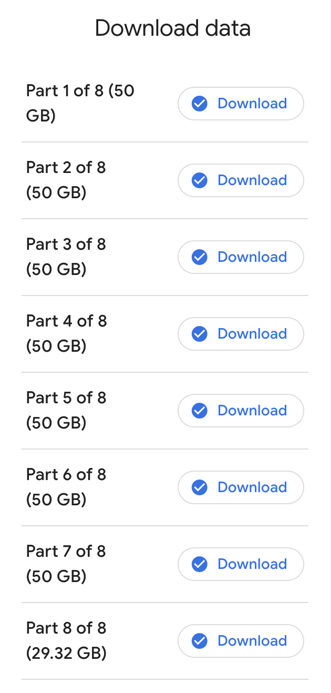
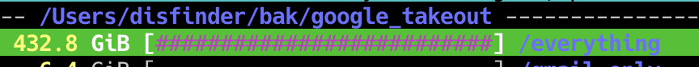

## Окей, Google, давай сюди що маєш

Вирішив [забрати у Гугла дані](https://takeout.google.com/), які той про мене назбирав.  
7х50Гб + 30Гб, немало...
<!--more-->


При створенні запиту на тейкаут гугл дозволяє вибрати тип і розмір архівів - zip/tgz і від 2 до 50 Гб. Я попросив найбільші тари, бо не хотілося возькатися із сотнями дрібних архівів, і був правий.

А, і ще самий перший мій запит на тейкаут провалився - прислав емейл, мовляв, "нє шмагла" - у деталях показує що не вдалося забрати дані із Nest. Неясно чому, чи повʼязано якось із тим, що термостат у попередніх апартаментах недоступний чи просто глюк, але створюючи наступний запит на тейкаут - Nest не відмітив і архів створився норм, 56 продуктів ([сервісів, які гугл ще не вбив](https://killedbygoogle.com/)) замість 57ми.

## Окей, юзер - забирай, якщо зможеш!

Десь із тиждень чи близько того (не засік) Гугл весь той тейкаут архівував, і прислав мені повідомлення, що готово.
Скачати через wget, ясна річ, не вийшло - треба ж wget якось авторизувати, фіг вам. Качав вручну, браузером - декілька разів перекачуючи те, що зафейлилося.  

Викачав. 432 Гб...


Коли я думав, що 2Тб на ноутбуці це в два (якщо не в 4) рази більше, аніж мені будь-коли буде потрібно, я не очікував, що четверть вільного місця займуть пожаті бекапи тих даних, які має про мене гугл.  
Здуру я спробував розпакувати, але зрозумів, що розпакований обʼєм буде куди більший і вільного місця банально не вистачить - вже все пожерто докером і ще бозна-чим (блін, а чим?)

## Тепер три дні заливаю це на сервер

```shell
$ /opt/homebrew/Cellar/rsync/3.2.7_1/bin/rsync --rsync-path=/bin/rsync  -r -v --progress -e ssh ./ ansible@10.10.10.10:/volume1/backup/google_takeout/disfinder.gmail.com/2023-12-25-all
sending incremental file list
takeout-20231221T191146Z-001.tgz
 53,687,107,361 100%   43.35MB/s    0:19:41 (xfr#1, to-chk=7/9)
takeout-20231221T191146Z-002.tgz
 53,687,109,371 100%  195.24MB/s    0:04:22 (xfr#2, to-chk=6/9)
takeout-20231221T191146Z-003.tgz
 53,687,107,296 100%    4.40MB/s    3:14:02 (xfr#3, to-chk=5/9)
takeout-20231221T191146Z-004.tgz
 53,687,104,226 100%   28.09MB/s    0:30:22 (xfr#4, to-chk=4/9)
takeout-20231221T191146Z-005.tgz
  7,589,330,944  14%   22.34MB/s    0:33:35
```

Тобто вже пройшов тиждень, а я все ще не бачив, а що ж у тих архівах.  `tar -tvf...` звісно можна запустити, але ж хочеться побачити повну картину.  
Сподіваюся, на сервері місця для розпакованого барахла вистачить, та не здивуюся, якщо розпаковувати доведеться двічі ні не туди, бо шифрований вольюм не любить довгі імена файлів, а чи любить їх Гугл і чи пхає у свій тейкаут - я ще не знаю.

2023-12-30: скопіювалося  
```text
sent 299,997,238,931 bytes  received 6,560,187 bytes  13,301,283.52 bytes/sec
total size is 407,294,955,301  speedup is 1.36
```

md5 хеші порівняв, сходяться.

## Розпакоука

```text
real 223m44.980s
user 56m50.523s
sys 148m21.597s
```

Розпакувалося досить швидко.  

Найбільше зайняли Гугл Фотки - що недивно, далі у папці Ютубу - мої власні відео, що я туди позаливав, насамкінець Гугл Драйв і пошта.
Отак розпакована папка виглядає у `ncdu`

```txt
--- Takeout --------
                                         /..
  316.7 GiB [##########################] /Google Photos
   42.8 GiB [###                       ] /YouTube and YouTube Music
   15.5 GiB [#                         ] /Drive
   13.1 GiB [#                         ] /Mail
    1.4 GiB [                          ] /Google Chat
  835.6 MiB [                          ] /Location History (Timeline)
  647.4 MiB [                          ] /Blogger
  230.2 MiB [                          ] /My Activity
  183.5 MiB [                          ] /Maps
   85.3 MiB [                          ] /Keep
   59.8 MiB [                          ] /Access Log Activity
   29.0 MiB [                          ]  archive_browser.html
   13.5 MiB [                          ] /Fit
   13.3 MiB [                          ] /Contacts
   10.9 MiB [                          ] /Voice
    4.6 MiB [                          ] /Chrome
    2.8 MiB [                          ] /Street View
  588.0 KiB [                          ] /Google Play Store
  412.0 KiB [                          ] /Recorder
  412.0 KiB [                          ] /Google Pay
  408.0 KiB [                          ] /Saved
  364.0 KiB [                          ] /Calendar
  224.0 KiB [                          ] /Groups
  184.0 KiB [                          ] /Reminders
  184.0 KiB [                          ] /Android Device Configuration Service
  152.0 KiB [                          ] /Google Account
  104.0 KiB [                          ] /Google Shopping
  100.0 KiB [                          ] /Home App
   84.0 KiB [                          ] /My Maps
   64.0 KiB [                          ] /Maps (your places)
   60.0 KiB [                          ] /Google Play Movies _ TV
   52.0 KiB [                          ] /Profile
   48.0 KiB [                          ] /Google Play Books
   40.0 KiB [                          ] /News
   36.0 KiB [                          ] /Tasks
   36.0 KiB [                          ] /Discover
   24.0 KiB [                          ] /Google Business Profile
   24.0 KiB [                          ] /Shopping Lists
   12.0 KiB [                          ] /Google Podcasts
   12.0 KiB [                          ] /Google Workspace Marketplace
   12.0 KiB [                          ] /Assistant Notes and Lists
   12.0 KiB [                          ] /Google Finance
   12.0 KiB [                          ] /Assignments
   12.0 KiB [                          ] /Search Contributions
   12.0 KiB [                          ] /Google Help Communities
```

## Дослідження

### Google Photos

Фотки складені по папкам альбомів і додатково по папкам років.  
Що засмучує - присутні дублікати, причому у клауді ж додавання файлу до нової папки не створює копію, а от при скачуванні задвоїли:


```txt
$ find . -type f -size +500M
./folder1/PXL_20220915_013956479.mp4
./folder2/PXL_20220915_013956479.mp4
...
```

Розбиратися і фіксити, скоріше за все, буде ніколи, а от із Гугл Клауду погрохати це відео - то буде найперша кандидатура, бо займають забагато, а хто їх коли передивляється?...

### Gmail

Один здоровенний файл на 13 гігів. Мда... Недивно, враховуючи що там всі аттачі всередині заююкані (чи за base64-кані?). Але тепер можна нарешті повикидати старий хлам із поштової скриньки.

```txt
/Takeout/Mail --------------------------------
   13.1 GiB [##########################]  All mail Including Spam and Trash.mbox
   40.0 KiB [                          ] /User Settings
```

### Google Drive

Тут принаймні без сюрпризів - файлики, папочки - як у веб-інтерфейсі. Дублікатів не шукав, та думаю, немає. Ну і обʼєми не такі, щоб переживати.

## Outro

Власне, цей тейкаут затіявся у процесі написання [статті про бекапи](/docs/articles/backup/)  і дав певну інформацію для роздумів та опрацювання.  
Почав писати цей допис 28 грудня 2023, а завершив 15 січня 2024, і то ще можна би було щось додати, та пар поки вийшов.
Як мінімум, тепер видно, що де лежить у гугла, і головне - що можна видалити.  
Не переключайтесь.
