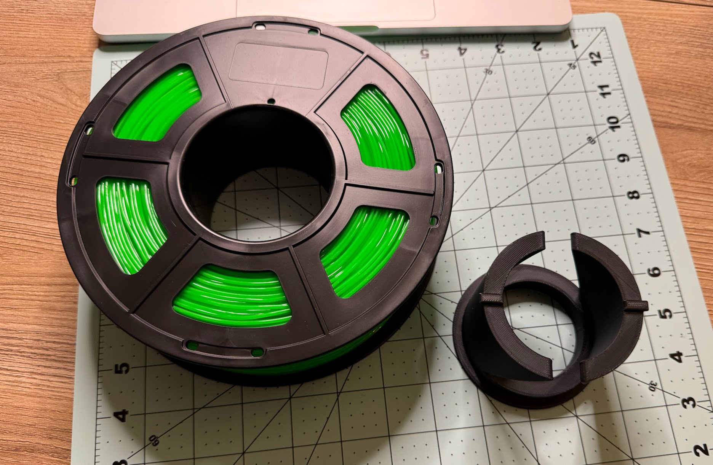

Будні 3Д-друкаря: доставили катушку філаменту, але вона (внутрішній діаметр) не підходить до системи подачі філаменту у принтері.
<!--more-->
Але ж це 3Дрюк! Добрі люди переді мною вже наступили на ці граблі - і зробили перехідник, моделлю якого радісно поділилися зі світом та комʼюніті.  

Але виходить так, що перед тим, як надрукувати щось потрібне, спочатку потрібно надрукувати щось не потрібне.  
Анекдот про "якби не було машини, я би не встиг сьогодні поміняти колеса, замінити акумулятор, зʼїздити на заправку та заїхати на СТО!" вже якось перестав бути смішним...

PS: і все це тільки для того, щоб вияснити (а точніше, згадати), що система подачі філаменту не підтримує цей конкретний філамент (TPU), тому його треба друкувати із зовнішнього тримача, якому пофігу на діаметр і можна було із цим перехідником голову не морочити...
