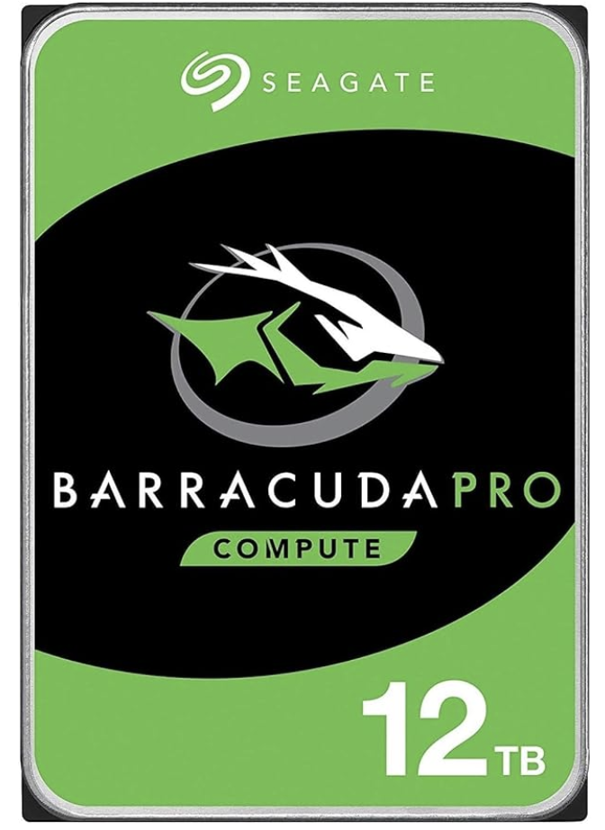
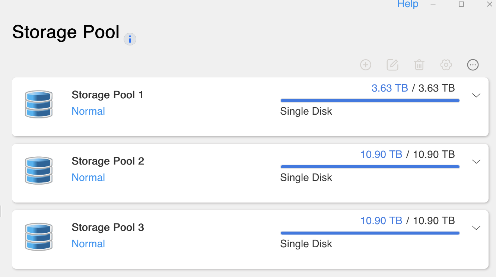

Диски у новий NAS я замовив несподівані.
<!--more-->
Вирішив водночас ризикнути та заощадити і тому взяв ось такі:

```txt
Seagate BarraCuda Pro 12TB
Internal Hard Drive Performance HDD –
3.5 Inch SATA 6 Gb/s 7200 RPM 256MB Cache
for Computer Desktop PC Laptop –
Frustration Free Packaging (ST12000DM0007)
(Renewed)
```

 

З одного боку: недорого (відносно) - $100 баксів за 12T диск це вдвічі дешевше за новий.  
З другого боку - сподіваюся, обидва водночас не помруть.  
З третьої сторони - ну сенс купити вдвічі дешевші диски і втулити їх в дзеркало? Ні, будуть окремими - але скидатиму туди щось некритичне.

Пристібаємся, поїхали.


