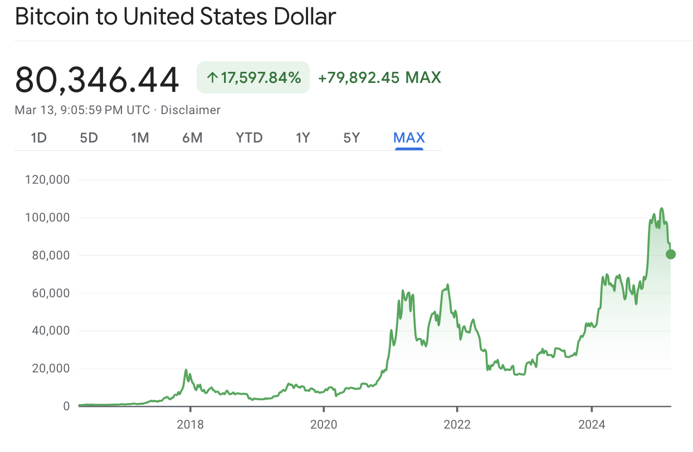
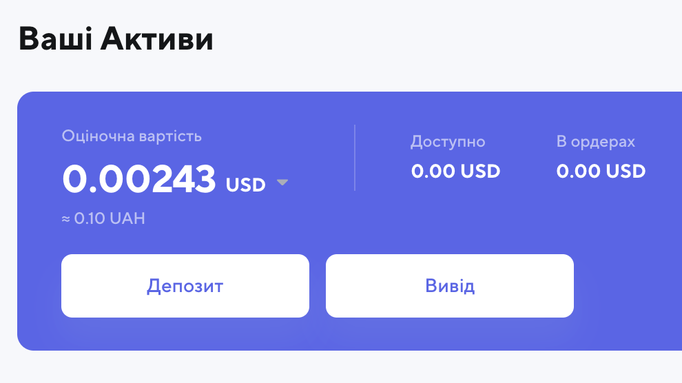
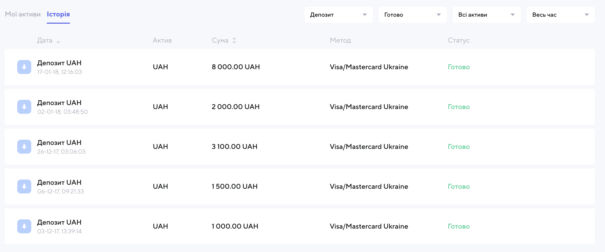
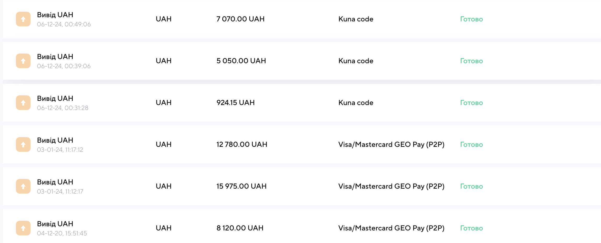

Сьогодні українська криптобіржа `kuna.io` прислала листа що вони всьо.
<!--more-->
Отак просто беруть і закривають біржу. Торги зупинено, тільки вивід на свої власні гаманці.  
Красивий лист про те як виконали свою функцію і час прибрати старе щоб почати нове - щож, буває.  
На щастя в мене там і так небагато було - деякий час тому назад вони скасували операції через банківські картки (думаю, регулятор втрутився абощо), тому я напрягся, вишкріб і повиводив гривневі залишки. Залишилося дрібʼязку десь менше двадцяти доларів, які сьогодні поїхали на крипогаманець до ПЖ - бо свого у мене досі немає :)

## Досвід

Сумарно я вклав побалуватися `15600` грн -і видно як із часом хоробрішав та транзакції росли. Ідея була закинути трошки грошей скільки не шкода щоб із перших рук отримати досвід "криптоінвестора".  
Історію торгів чомусь не видно, тому не памʼятаю за скільки тоді у 2017-2018 можна було купити біткоїн та ефір. Гугл на своєму графіку сьогодні видає ціну $10-20k за 1. Звичайно, одразу ж після купівлі він обвалився і я з метою збереження нервових клітин вирішив не заглядати - типу попрощався ну і ок.  
За роки багато сталося - в першу чергу переїзд, втрати близьких, ковід - і от в 2020 біток відскочив, я щось там вивів і знову полишив на 4 роки.  
В квітні 2024 при цінах в $30k я повиводив основну масу, бо вирішив що по-перше вже далі рости нікуди, а по-друге я награвся і треба забрати поки є - якраз оплачу комунальні послуги своїм київлянам.  
У грудні 2024 при ціні в 100к в мене залишилися тільки зовсім невеликі крихти і велике здивування.  

Усього сумарно вивів на `49919.15`та ще і трошки залишилося.  (оця двадцятка USDT для волонтерів)  
Трикратний прибуток - досить непогано!  
Дякую куні (хехехе) за досвід.

## Депозити

## Вивід

