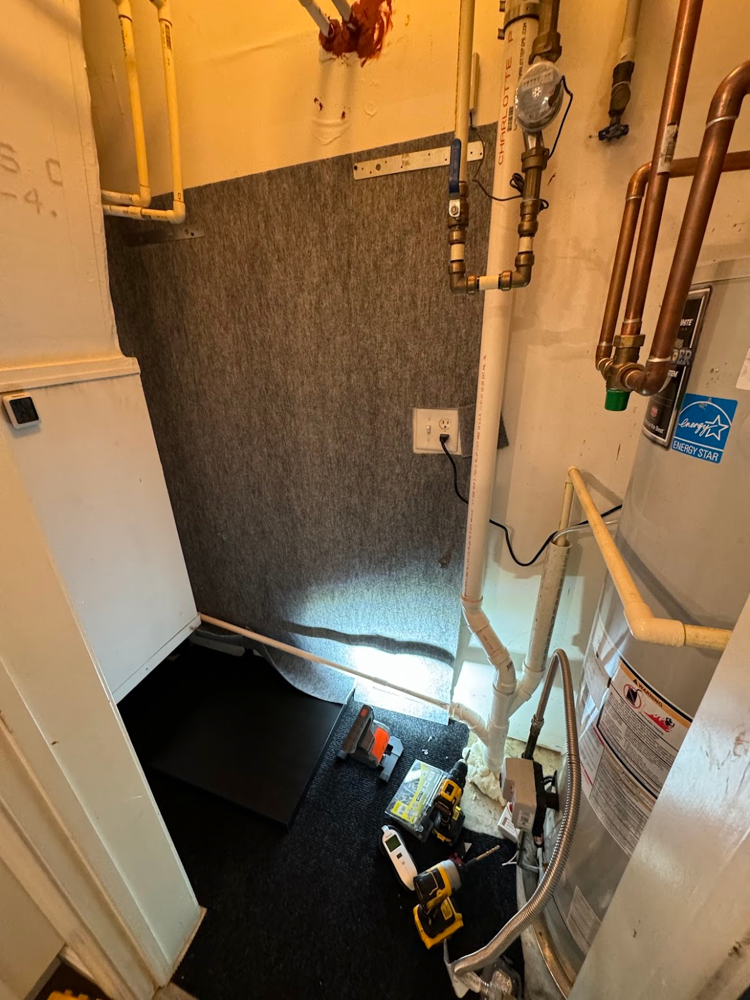
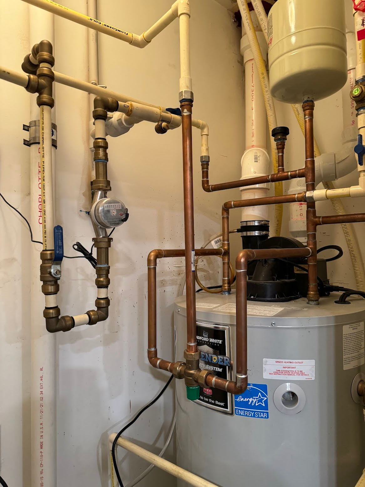
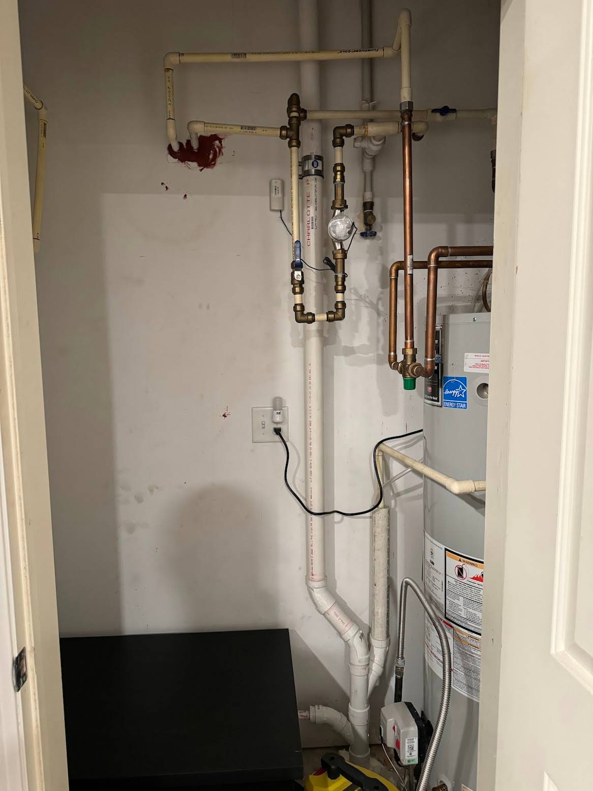
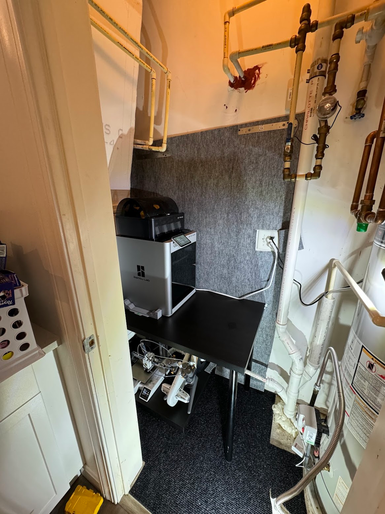
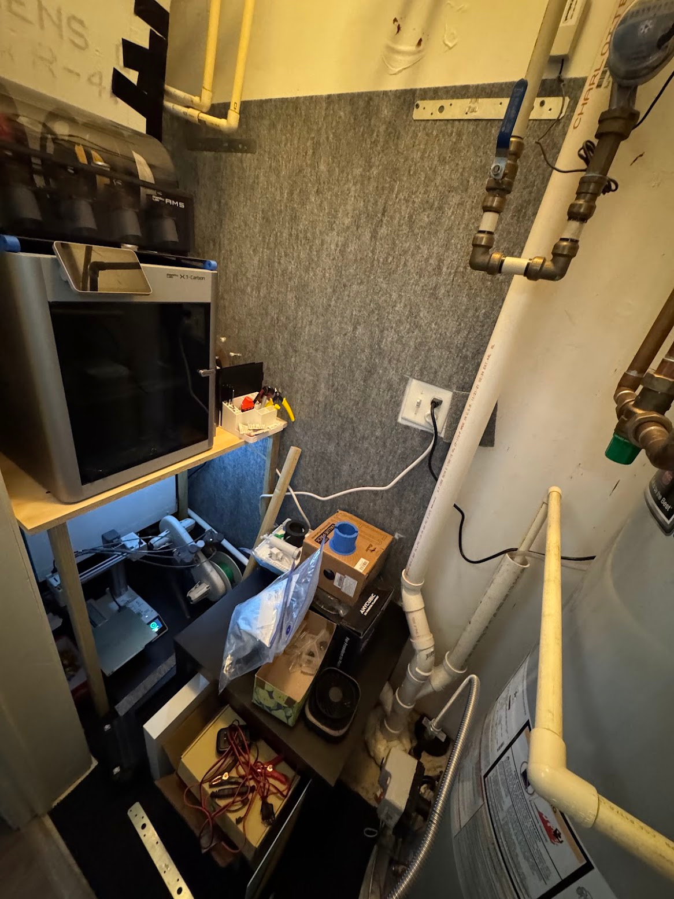
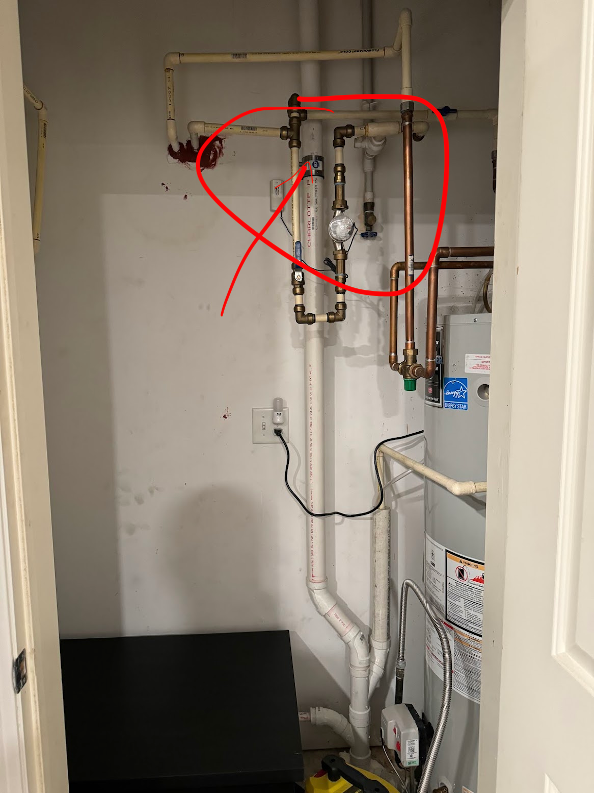

Я дуже вчасно перемістив сервери.
<!--more-->

## Бойлєрна

Через те, що [Вертеру не знайшлося місця](/docs/projects/server-shelf/) у нашому житлі, мені довелося ховати мотлох у досить поганенькому місці: невеличкій кладовці між кухнею і ванною кімнатою, в якій до того ж розміщені з одного боку бойлер, з іншого - кондиціонер.

Взагалі ця кладовка не для доступу жильців і була замкнена на ключик, та в умовах обмеженого простору довелося її відкрити і задіяти.

Як красиво там навісним монтажем розміщено купу труб я ще довго використовуватиму як приклад ~~срала-мазала~~ good enough. Сподіваюся, дуже довго - побачити щось гірше мені трошки лячно.

## Принтерна

Розміщення добра пережило декілька ітерацій, і не всі я здогадався сфотографувати (чи просто не можу знайти).

Через те, що труби висять скрізь у повітрі, і навіть попід стіною йдуть не впритул, а навкосяк - всі рішення доводилося підганяти під це косойобство. Я підпилював столи, збирав із фанери, уголків і дощечок кастомні полки, купував возики на колесах - все, аби впихнути невпихуєме.

## Серверна

Через те, що сервери гудять і шкрябають дисками, а хорошого місця для них нема, то в одній із ітерацій прямо посередині бойлєрної на підлозі (аби не гойдалися) стояли одне на одному два домашніх NASи, і всі приблуди до них - безперебійник, свіч, тощо.

Коли робітники чистили кондиціонер і заглянули в цю кладовку, то мʼяко натякнули що я не маю її використовувати і взагалі це не дуже гарна ідея.

На додачу ще я і втомився від того, що сервери довелося підключити через WiFi-екстендер, бо ніяких же UTP розеток у цьому сервісному приміщенні не передбачено.

Почухав потилицю і перетягнув усе мережево-насове обладнання у тумбу під телевізор, зробивши в тій тубмі child-proof кришку із прикрученої шурупами фанери - бо основна мета приховування цього обладнання це не дати до нього доступ молодій допитливій людині.
До тумби вдалося дотягти UTP кабель, що значно покращило швидкість - алілуйя. А звільнений у бойлерній простір перетерпів чергову реорганізацію.

## Потоп(чик)

Терміново розбираючи сетап та витираючи калюжки, я навіть забув все те сфоткати.

Велика вертикальна пластикова труба "луснула" - в тому місці де чорна латка зʼєднувала дві половинки двома хомутами. Нижня частина зігнулася і вискочила із кріплення, то із вернхьої текло вниз на все, що стояло під тою трубою.

На превелике щастя, там стояли тільки запчастини та філамент у пакетах, а сама труба не каналізація, а відвід конденсату від кондиціонерів та ще чогось від бойлера. Тому потоп виявився невеличким, дрібʼязковим - навіть калюж було небагато, здебільшого вода назбиралася в ящичках, все інше впитав гаражний килимок, що я постелив на підлогу. І на момент як я потоп побачив - вже нічого не текло, лишилися тільки наслідки.

## Передислокація

Розуміючи, що за наявності мого барахла там де його не повинно бути, на мене буде повішено всіх собак - довелося серед ночі все терміново розбирати. Витирати, розбирати, переносити у сторадж.

Спеціалісти, поки ремонтували, до речі, сказали що трубу погнуло від гарячої води - десь зверху бойлер протік, потекла вода і від того труба покоробилася. І що ще десь у будинку є подібна історія.

Пощастило, що із електроніки намок тільки акумуляторний вентилятор. Найбільше шкода звісно потраченого часу, і часу на новий проект - а куди ж розмістити барахло замість скомпрометованої бойлерної.

Ну і пощастило, що сервери із терабайтами добра покинули епіцентр трагедії пару місяців назад.
