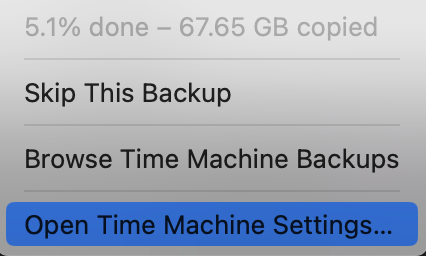

Тайм машина - заповнена, несіть нову.
<!--more-->
Із незрозумілих мені причин, Time Machine не хоче або не може працювати як обіцялося - витісняти більш старі архіви/версії коли закінчується місце - і тому час від часу каже мені "нє шмагла" і відмовляється бекапити.

Можливо тому, що отримувач - це не справжня Еппловська тайм машина, а спеціально налаштована (відповідно до якихось нагуглених інструкцій) папка на [Synology](/tags/synology/)...

Якщо раніше я просто чистив папку і починав спочатку, зараз вирішив - є ж [додаткове місце на Тесеракті](posts/2025/01/11/used-hdd/), тому не будемо викидати зараз, викинемо пізніше.

## Запхати тайм машину у архів

```shell
$ time tar czvf /volume4/garbage/TimeMachineMaxbooka.2025-05-17.tgz /volume1/TimeMachineMaxbooka/

...
real    3753m26.940s
user    3641m48.425s
sys     149m32.053s
```

## Перекласти архів на сусідній сервер

```shell
ansible@boxtree:/volume1$ time rsync --progress /volume4/garbage/TimeMachineMaxbooka.2025-05-17.tgz /volume1/tess/inbox-volume3/
TimeMachineMaxbooka.2025-05-17.tgz
2,617,104,238,550 100%  108.64MB/s    6:22:53 (total: 100%) (xfr#1, to-chk=0/1)

real    382m57.072s
user    272m56.536s
sys     157m33.856s
```

## Почистити папку

```shell
time rsync -aP  --delete ./empty/ /volume1/TimeMachineMaxbooka/maxbooka.purgeable/
...
real    2m31.497s
user    0m0.212s
sys     0m12.455s
```

## Зробити бекап

Поїхало.


