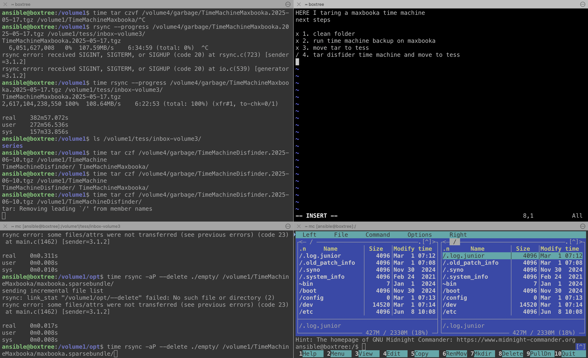

Записки самому собі як в [Memento](https://www.imdb.com/title/tt0209144/) або Post-it стікери на моніторі вашої бабусі.
<!--more-->
Під час довготривалих процесів на домашніх серверах у мене відкривається багато тмуксових вкладок і вікон - в одному щось архівується, в іншому качається, там десь кудись переміщується...

Часто це триває днями - не тільки того, що 2 Тб запакувати скільки займає часу, а тому що я не так оперативно і регулярно заглядаю в термінал (і в ноут взагалі), і забуваю що там де як відбувалося.

І ось дійшов до простого і - тепер здається - очевидного рішення: написати в одному із регіонів, що тут взагалі відбувається, який план і що далі. Такий собі туду для цієї вкладки із трьох вікон. Мені здається, геніально.

