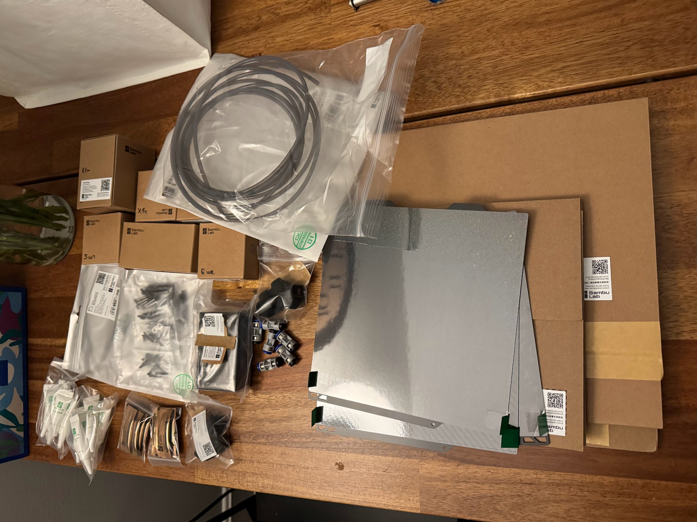
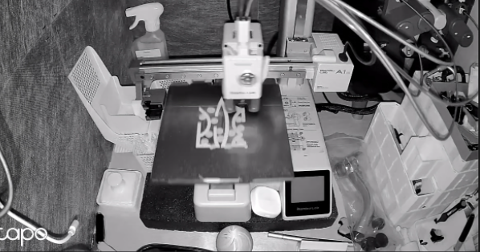

Поламалася в принтері камера.
<!--more-->
## Камера поламалася

Написав у саппорт, кажуть - замовте модуль камери і поміняйте. Я - ~а чо бя єслі нє?~ а якщо не допоможе? Ну тоді, шановний сер, перевідкрийте тікет і ми вам будемо раді допомогти!

Замовив я камеру ($30), але ж доставка платна - ну то значить треба замовити ще щось, а тут хоба розпродаж - ой, беру і те, і це, і одне, і інше...

## Замовлення прийшло

Замовив я вобщім на $180 в результаті...

Давно треба було `PTFE адаптер`, та і `Tube coupler`, одне до іншого - отак і вийшло...

## Камера

А от камеру я поміняв - і не помогло.

Пишу знову в саппорт - мені у відповідь: ой, як шкода, ну ось ми вам безкоштовно вислали `main board` до вашого принтера, ось інструкція як міняти. 

Я кажу - а шо якщо це кабель? - Ой, шановний сер, тоді перевідкрийте тікет і ми будемо раді вам допомогти!

## Альтернатива

Почитав інструкцію, подивився на плату, почухав потилицю - і так як я вже нещодавно зробив крок до "розумного дому", [поставивши трошки датчиків (а головне - хаб)](/posts/2025/06/11/smart-sensors/), то за $20 баксів купив зовнішню камеру, яка не тільки передає 1080p замість куцого хєрпойми шо, так ще і в темряві бачить і FPS нормальний видає.

А материнка до принтера хай поки полежить. Поки ще щось поламається.
