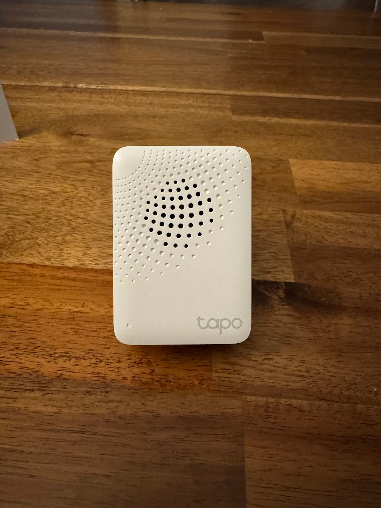

Трошки зʼявилося розуміння які штуки може дати IOT/smart home.
<!--more-->
Так як проект [Tardis](/docs/projects/tardis/) (наразі не завершений) певною мірою небезпечний - принтери у закритій шафі можуть перегрітися і потенційно аж до пожежі, зʼявляється потреба у моніторингу та контролю.

## Платформа

У Ікею їздити далеко, а на Амазоні задешево продається китайський TP-LINK під брендом TAPO. В мене вже є wifi extender від ТП-Лінка і взагалі нарікань окрім потенційних бекдорів для компартії наче нема - тому я затарився ТУПО сенсорами.

## Хаб

Як мабуть зі всіма такими рішеннями, має бути вендор-локнутий хаб, до якого вже все інше буде підключатися - датчик просто так працювати не буде.

Цей хаб ще може і певні звуки видавати - дверний дзвінок різного штибу, тривожні сигналізації, тощо.

Вткнув у резетку, підключив у мобільній аплікухі, все норм.

## Датчик із екраном

Хоча один датчик таки може працювати і без хабу - має `e-ink` екран та може показувати свої виміри (температура і волога) прямо на собі. Ну і як підключити до хабу, то починає збирати і рапортувати свої заміри на китайський сервер і потім можна дивитися онлайн та історичні дані (2 роки, здається)
`

## Датчики без екранів

Дешевших датчиків, що теж міряють температуру і вологу, але тільки звітують в хаб, без екрану - я накупив вже декілька.

## Моніторинг морозилки

На додачу до Тардісу міряти температуру іншого принтера, я закинув один у морозильну камеру.

Через те, що камера стоїть в кладовці, яку [заливало два рази (на сьогодні)](tags/flood/), то я купив іще і датчик затоплення та розумну розетку. 

В апплікухі легко налаштовуються smart actions - якщо датчик затоплення спрацював, вимкнути розетку морозилку (аби йобом не токнуло).

А іще якщо температура морозилки піднімається вище (наприклад) -10°C і при цьому розетка включена - надіслати повідомлення (ну не має ж розморожуватися коли все включене).

## Ворота необмежених можливостей

Ще є датчик відкриття дверей - можна налаштувати, якщо відкрилися дитиною двері шафки, відправити повідомлення і/або ввімкнути сирену, але то вже колись потім.

А, ну і [камера як заміна поламаної](/posts/2025/07/13/printer-camera/) - теж із цієї опери.
