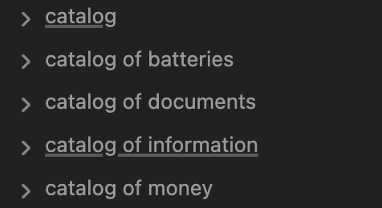

В дитинстві я про все знав що де лежить.
<!--more-->
І тому в своєму домі я був головним "інструментом" відповіді на питання на кшталт "а де зараз лежить ота штука яка потрібна одного разу на рік...?"

В дитинстві голова в мене була порожня і свіжа, речей у домі небагато, і їх місцезнаходження плюс-мінус стабільне.

Сьогодні, коли голова не така свіжа, речей (завдяки капіталізму і consumer society) стало багацько, а місцезнаходження після декількох переїздів змінювалося неймовірну кількість разів, тримати всі ці дані у своїй голові стало важко, а не знаходити потрібних речей - прикро.

В давні часи популярності CD-ROM я намагався користуватися програмами-каталогами: вони сканували диск, записували його файлову структуру собі в базу і таким чином посканувавши диски одного разу, можна було швидко шукати по всьому "каталогу" не перебираючи їх вручну.
Здавалося би, має бути щось подібне і для інвентаризації фізичних обʼєктів, не я ж перший маю таку потребу.

І ось якось, працюючи над дещо іншим проектом - а саме, вивантажуючи інформацію в `second brain` за допомогою [Obsidian](https://obsidian.md/), я випадково натрапив на вирішення проблеми інвентаризації за допомогою цього інструмента.

Настільки мені ця ідея сподобалася, що я завів собі навіть декілька каталогів, а іще описав це все у [окремій статті](/docs/articles/obsidian-catalog/).

