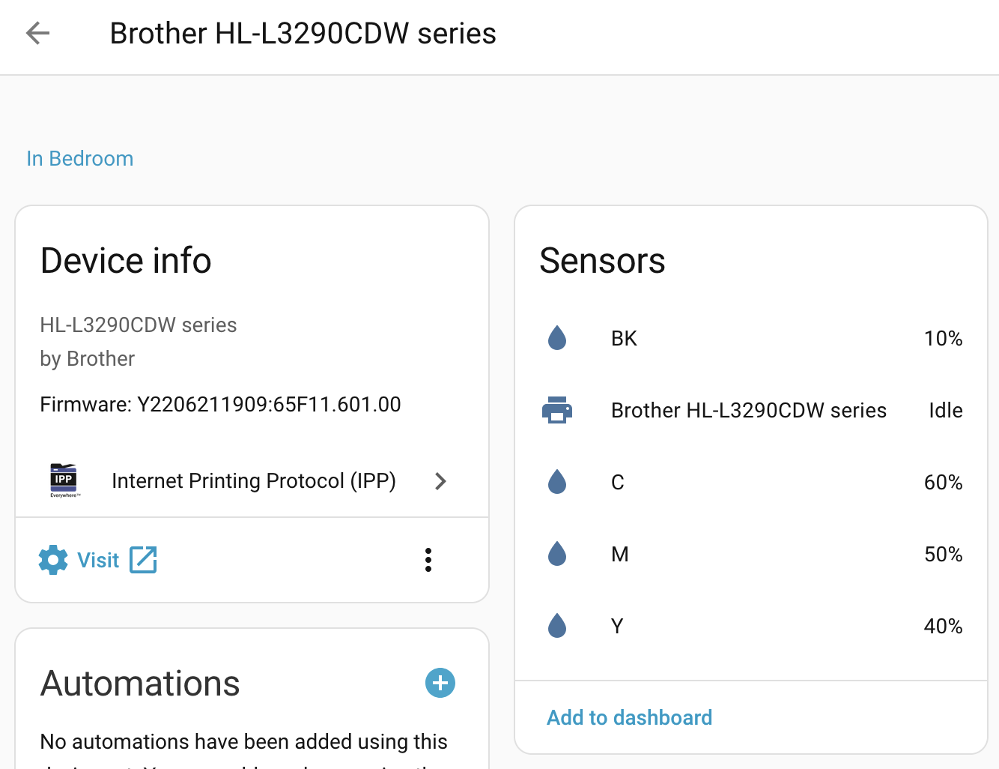

Поставив я тут зненацька [Home Assistant](https://www.home-assistant.io/).  
Божечки, яка краса!
<!--more-->

І хоча із цим супер кобмайном ще розбиратися і розбиратися - та гратися і гратися (як шкода що його в мене не було років 15 назад!) - та навіть криво нашвидкоруч наконфігурований дашборд показав мені дещо цікаве: лазерний принтер, що вже із пару місяців мені муляє "в чорному картриджі караул як мало тонера!" виявляється репортує, що його там аж цілих 10%!

А от батарейка у пульту до колонки на телевізорі, яка теж у IKEA HUB світиться як слабенька - звітує про всього лише 1%

Не вийшло так само легко моніторити трафік на роутері - порти всі знайшлися за допомогою [кастомної інтеграції](https://github.com/tomaae/homeassistant-mikrotik_router), їх видно, але можна їх лише включити/виключити, а побачити скільки бігає даних чогось не вдалося. Гуглив кілька годин, покищо здався - і так вже прикольно получилося. Спробую може у [MrGall](https://mrgall.com/blog/2025/03/30/youtube-channels-feed) розпитати...

Вобщім, потрошку колупатимуся. Довгми зимніми вечорами ))))

## UPD: Поборов!

