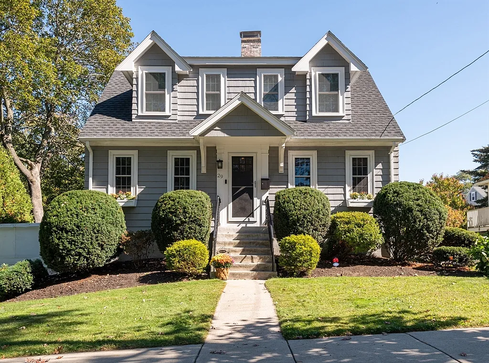

## Штучний інтелект на марші

Надворі квітень 2026 року (хоча погода на лютий), коса штучного інтелекту крокує по планеті і викошує динозаврів, техногіганти відправляють у лейоффи людей тисячами.
<!--more-->

## Ретропост
Через марновірство та якийсь острах "ось ми поділимося радістю, а потім піде шось не так" - ми ніколи не розказуємо нічого нікому наперед.  
Але ж так довго не можна, є емоції і поділитися ними хочеться. Як проходить час - вони забуваються, згасають, витісняються новими (не завжди радісними) або справами-турботами, то так і живеться якось у сумоті.  
Але ж у блог я можу написати сьогодні, поставити дату сьогодні, а "відправити в друк" - коли все закінчиться (вдало чи невдало)  
Тому ось такий спосіб залучення технологій до спілкування.

## Плани та наміри

Ми певний час  неквапно розглядаємо купівлю хати, бо оренда в США капець яка дорога, майже стільки як іпотека.

Але навіть враховуючи, що рієлтори тут докладають багато зусиль аби допомогти (в хорошому сенсі), все одно пошук будинку це ціла робота:
- треба передивлятися оголошення
- дивитися чи підходить по локації
- дивитися чи не занадто старий (бо продаються будинки 1920х років і навіть 1890х)

Якщо раптом щось сподобалося - то треба їхати дивитися. А поїхати всім разом виходить тільки на вихідні, і якщо буває що їхати годину - це пригода на день щоб подивитися один будинок. Причому враховуючи що ми (я) не надто в курсі навколишніх міст - уявлення не маєш, що там буде навкруги.

## Перша спроба
Будинок що нам сподобався, був хвилин за 50 від теперішнього помешкання, не надто старий, не дуже малий, до електрички доступний і за ціну прийнятну. Походивши по ньому - ми вирішили, що подобається, уявно розвішали штори, посадиоли огірочки і зробили пропозицію.

### Ставка
Якщо будинок нормальний, то в ньому буде зацікавлено декілька покупців і відповідно продавець обирає з-поміж декількох пропозицій. Наша сподобалася і вийшла в топ-2 і нам запропонували "скільки ви можете додати". Ми додали скільки могли, і виявилося що додали більше ніж "конкуренти"-покупці, але все одно вибрали їх, бо вони запропонували більший початковий внесок, а це продавця привабило більше, показало серйозність намірів і більші шанси що продаж відбудеться вдало і у встановлені строки. У продавця були якісь там вимоги продати пошвидше через зміну роботи.

### Програш
~~Коли хтось кращий за тебе~~  
~~Коли програєш~~  
Коли сподівання не здійснюються - це боляче. Уявні фіранки довелося знімати, а урожаю із посаженого уявного городу не сталося. Ми розстроїлися і ідею відкинули - часу обдивлятися, кататися, дізнаватися не було.

## Друга спроба
Несподівано неподалік від нас зʼявляється цікавий варіант за дуже приємну ціну.

Позаяк далеко їхати не треба, а полазити по чиїйсь хаті - досить цікаво, дивимося.  
Подобається - супер. Не надто старий, кондиціонер на дві зони, опалення, горіще (!!!), камін, ганок, подвірʼя - ну просто супер. Здається, навіть був чи гараж, чи підвал, чи обоє (а то взагалі джек-пот).
### Ставка
Але на той будинок бажаючих було дуже багато. Самих переглядів у один день було більше сотні, а це на порядок більше ніж звичайно. Пропозицію ми зробили, і одназу сказали що серед достойних пропозицій буде другий тур, то ми прямо вірили в себе. Зробили пропозицію, залишивши трошки місця "навиріст"
### Програш
Але другого тура не сталося - якийсь покупець зробив скажену пропозицію на 20% більше за запрошену ціну, і це прямо дофіга. Всі конкуренти, включаючи нас, спіймали здоровенного облизня.

## Третя спроба
Коли я зрозумів, за скільки продається будинок, що нас влаштовує по стану та локації і наскільки він нам не по кишені - я розслабився, розуміючи що скоро нам нічого не світить.  
Тому на наступний перегляд поїхав подивитися без ніяких очікувань.

### Ставка
Але будинок нам несподівано сподобався. В ньому ось щойно жили люди - ще тут їхнє барахло у шафах і харчі у холодильнику - і його стан не викликав якогось відторгнення, як буває, запахом, чи брудом чи ще чимось. Є гараж, підвал, не надто старий, центральний кондиціонер та газове опалення, маленький дворик. Все гаразд, мінус - невеликий.

Запрошена ціна була завищена, тому ми зробили більш реальну до ринку пропозицію.
### Виграш
І виграли.

## Шо далі
Тепер поки я стягую гроші із різних далеких кишеньок для першого платежу, треба ще отримати власне позику щоб той дім купити.  
Наступний майлстоун буде підписання договору купівлі-продажу, до нього треба зробити інспекцію - чи все гараз, чи не гниє-не тече-не розвалюється, і рухатися до власне закриття угоди.

### Що паганого
- доведеться вигрібти всі гроші
- і віддавати більшість за позику, суттєво прикрутивши марнотратство
- ну і найгірше це що робити якщо (коли?) наші робо-повелителі відберуть у мене роботу
### Що хорошого
- доведеться прикрутити марнотарство
- наявність власного дому (із гаражем та підвалом!) відкриває двері численних можливостей для дрібних цікавих проектів - купу способів як приємно провести час, роблячи щось руками, налагоджуючи свій побут огранізовуючи бардак

