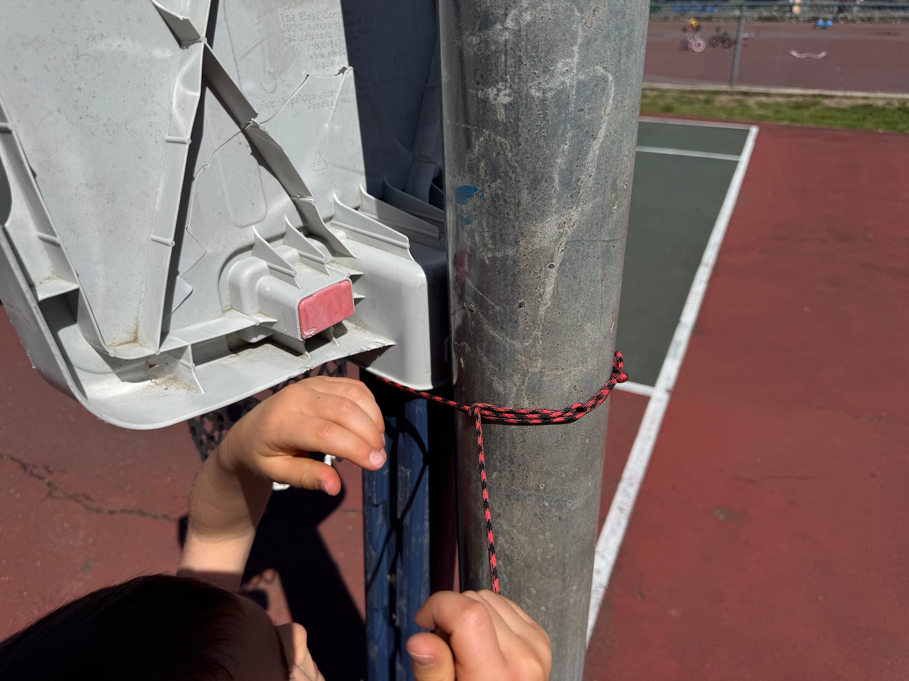

Несподівано дуже корисним інструментом у батькуванні стала мотузка.
<!--more-->
І ні, не для того, щоб привзязати спиногриза.

Звичайною мотузкою, менше двох метрів завдовжки (аби моточок компактно поміщався у сумку) та із фіксованою петелькою на одному з кінців, я:
- тягав санки
- тягав велосипед нагору
- притримував велосипед з гори
- ще півсотні якихось застосувань, про які не можу згадати зараз

А ось сьогодні примотав іграшкову баскетбольну корзинку до стовба справжньої - бо так стояти не хотіла і від влучань мʼяча падала.

