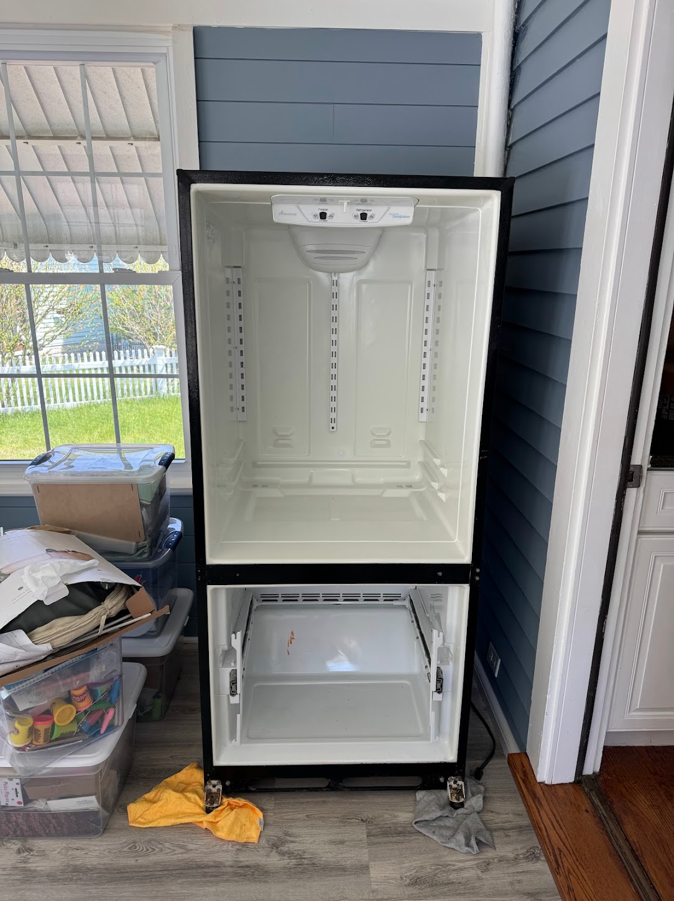

Нізя просто так взять і пересунуть холодильник у іншу кімнату
<!--more-->

## А як можна?

- замовити спеціальні шлейки для переноски
- відкрутити дверцята морозилки
- відкрутити дверцята холодильника
- покласти холодильник на бік
- відкрутити ніжки холодильника - випирають поза корпусом
- зняти з петель двері між кімнатами
- пропхати під нього шлейки
- пронести удвох холодильник у двері
- **зацінити, як залишається менш ніж по пів сантиметра з кожного боку**
- попилососити дно холодильника (там радіатори і пил)
- прикрутити ніжки холодильника
- поставити холодильник на ніжки
- витерти із нутрощів конденсат
- поставити дверцята морозилки
- поставити дверцята холодильника
- поставити на петлі двері між кімнатами
- почекати 2 години поки всядеться хладагент
- почекати поки висохне конденсат у механізмах дверцят
- можна включати!

## Підсумок

Отаким нехитрим чином пропозиція на 5 хвилин "зайшли і вийшли" перетворюється у справу на добрих пів дня.

Холодильник без ентузіазму дивиться на нове місце роботи.

## Бонус

А іще стає видно, що резинка нагорі дверей лопнула-порвалася і треба чи міняти, чи викидати, чи шось робити...
