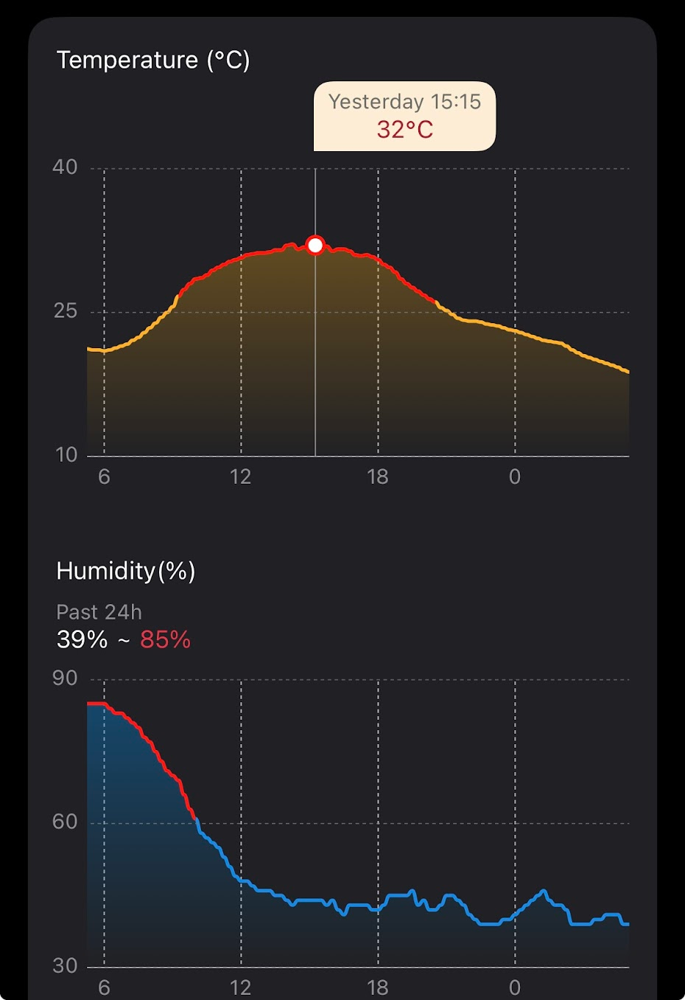
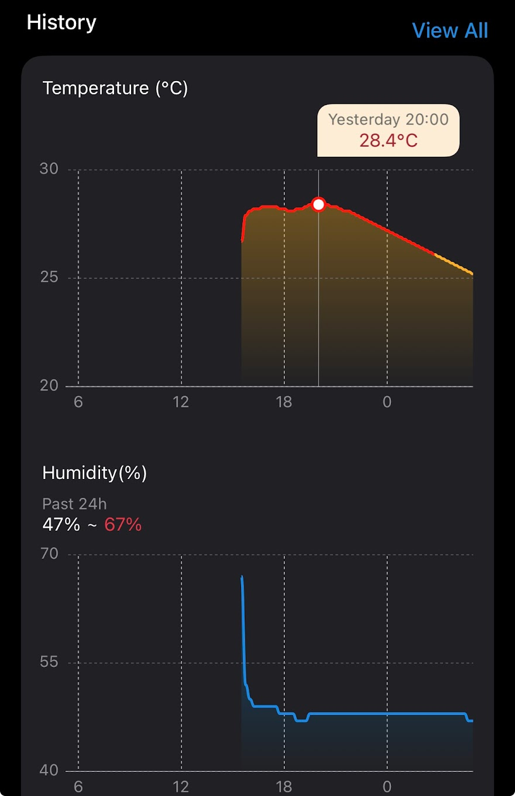
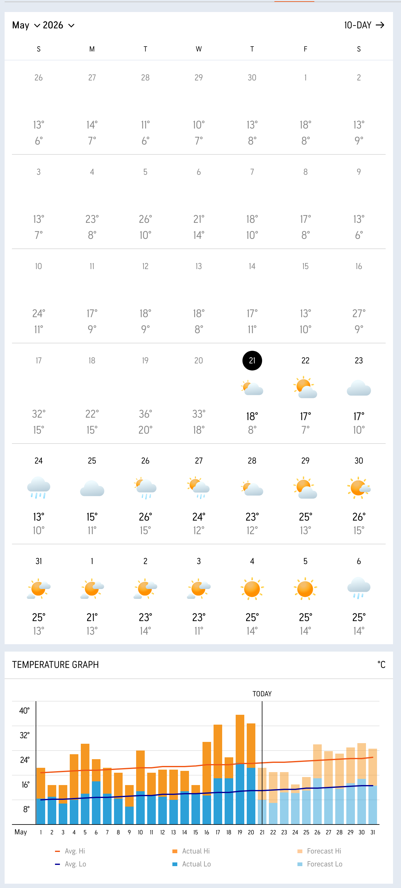
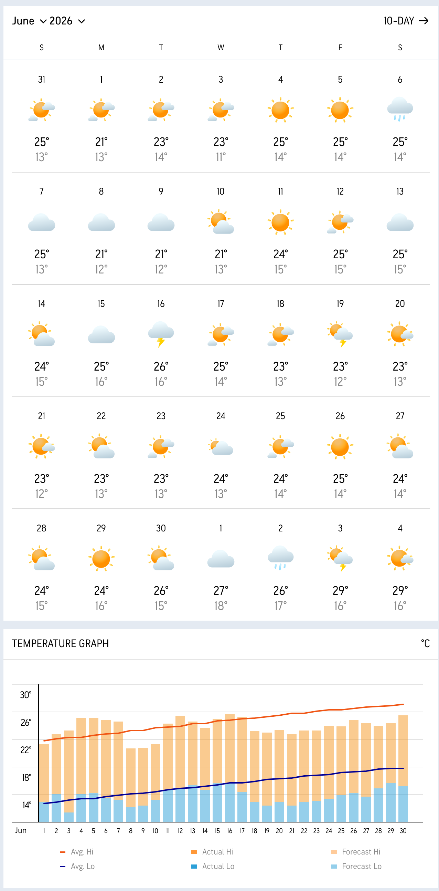
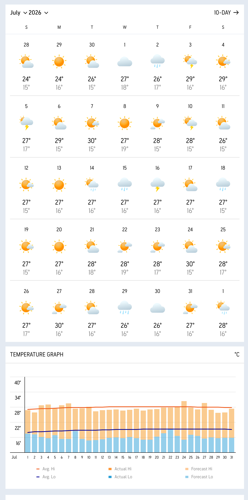
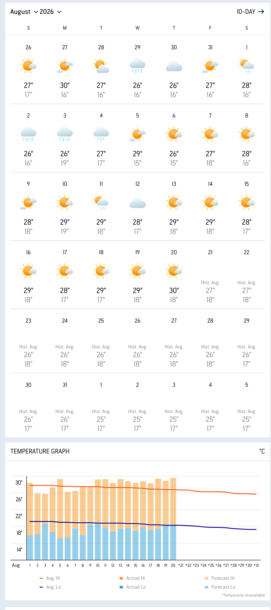
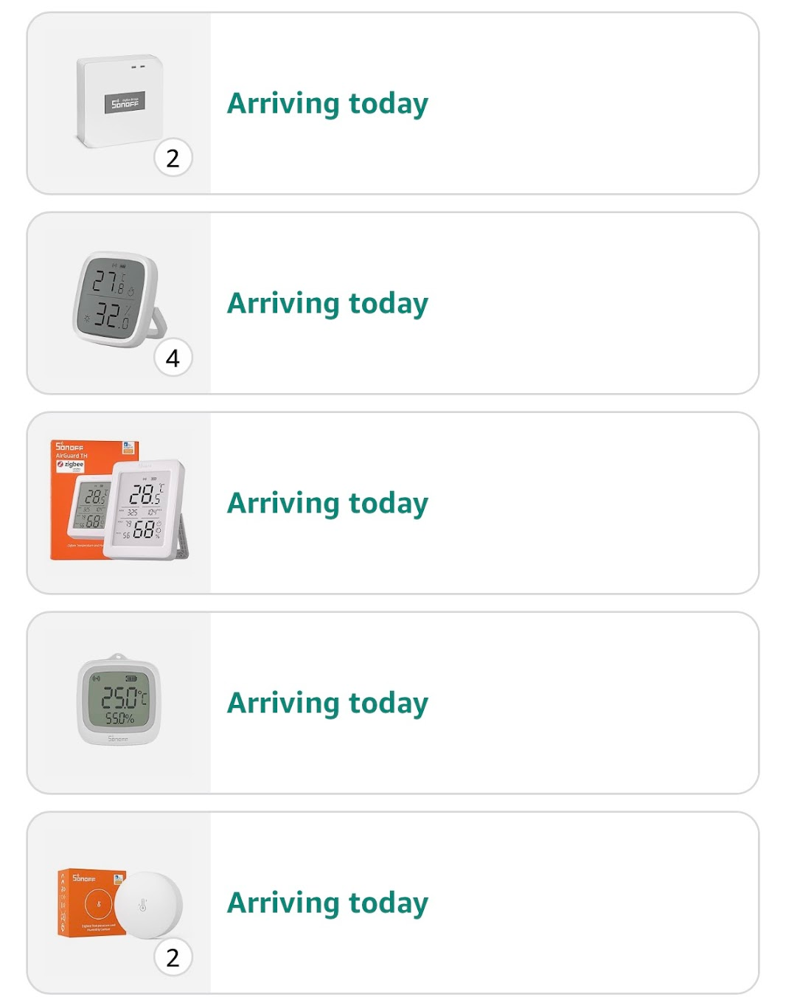

+36 у травні, як вам?
<!--more-->
## Фактична температура
Кондиціонер не вимикається, і все одно не може охолодити приміщення із 25 до 21.

На другому поверсі всього 3 вентиляційних виходи, більшість повітря йде на перший поверх - тому спальня навіть увечері довго ще була гарячою.

### На вулиці

### Всередині
Датчик знайшов і підключив лише надвечір, тому дані не зовсім повні і не вирівняні із вуличним графіком.

## Прогноз
Поки я розмірковую, як із цьою бідою жить та що можна зробити, захотілося поглянути - а що ж нас чекає надалі, і вирішив зафіксувати показники "прогнозу" погоди на це літо, дані із [AccuWeather](https://www.accuweather.com)

На сьогодні під кінець серпня вже починаються історичні дані, а не прогноз, тому обмежимося лише літом.

### Травень 2026

### Червень 2026

### Липень 2026

### Серпень 2026

## Підсумки
Якщо прогнозу вірити, то виглядає все не так погано, і девіація за ++30 має повторитися не скоро.

Однак прогноз на те і прогноз, щоб не справджуватися, тому напевно портативний віконний кондиціонер буде не зайвим.

Принаймні, раз вже почав заміряти і збирати дані - то хоч буде на чому робити висновки.

## Моніторинг
У гаражі спека пекельна (точних даних немає), тож облаштовувати там майстерню або не вийде, або треба спершу дуже добре теплоізолювати.

Закупився іще додатковими датчиками, чекаю поки доїдуть та буду натикувати скрізь.

