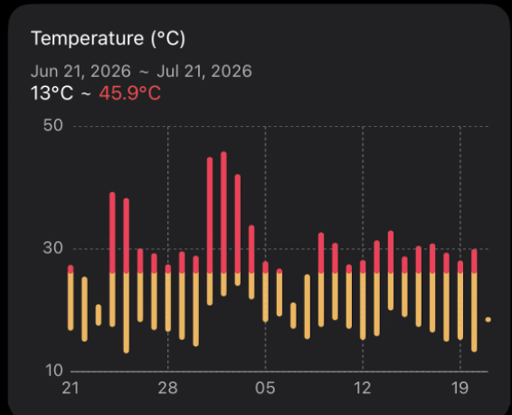
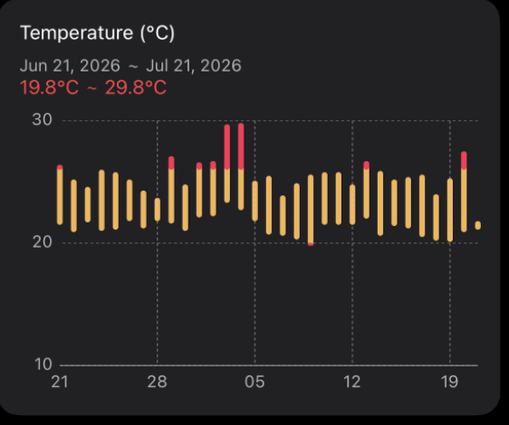
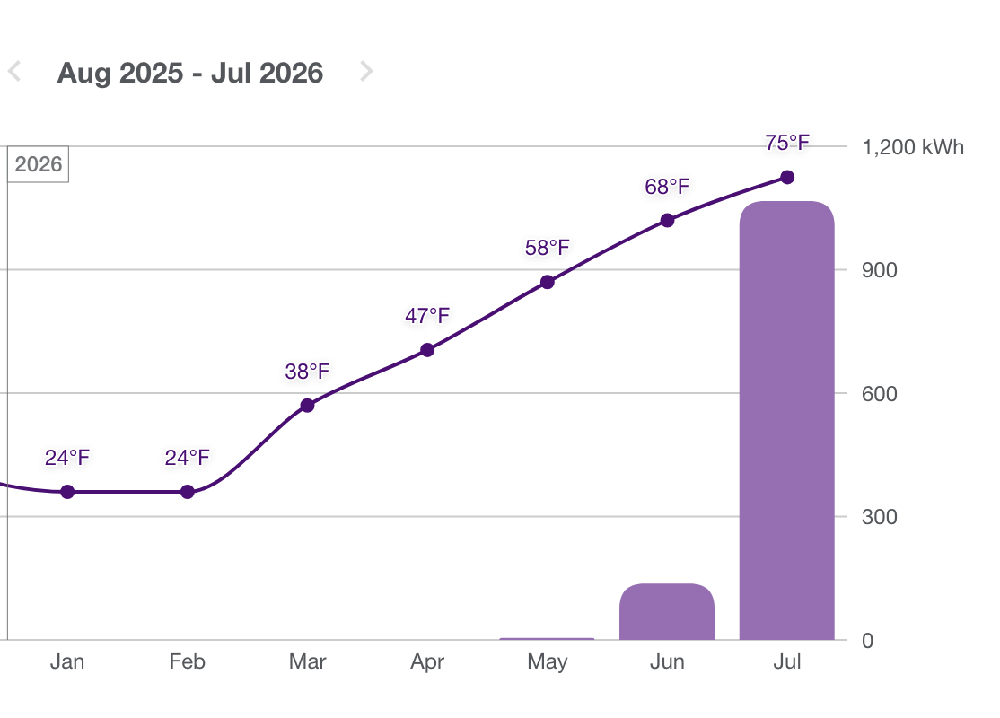
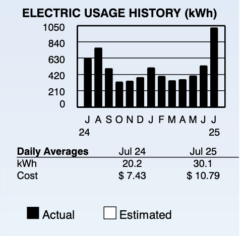
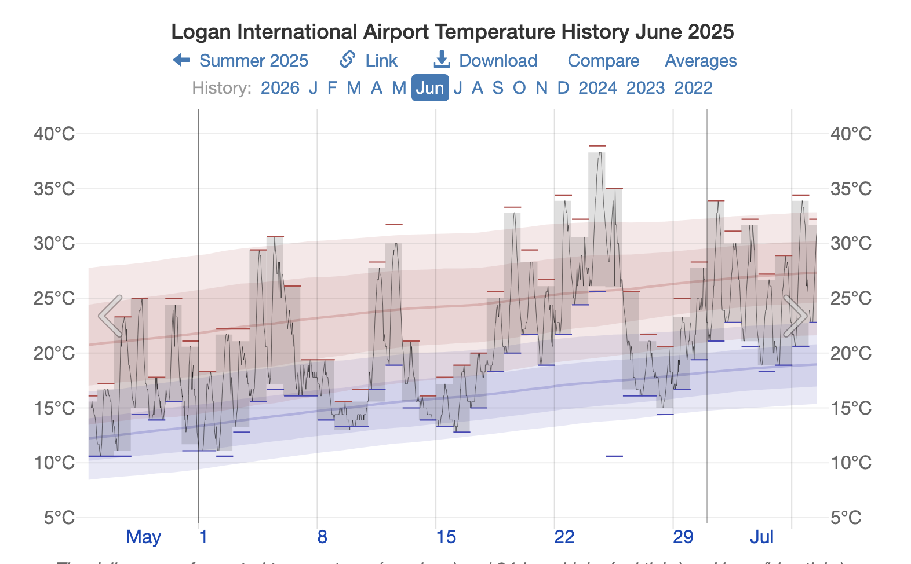
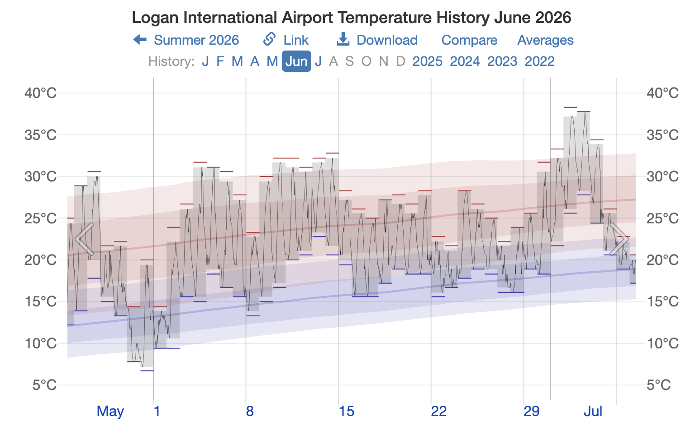
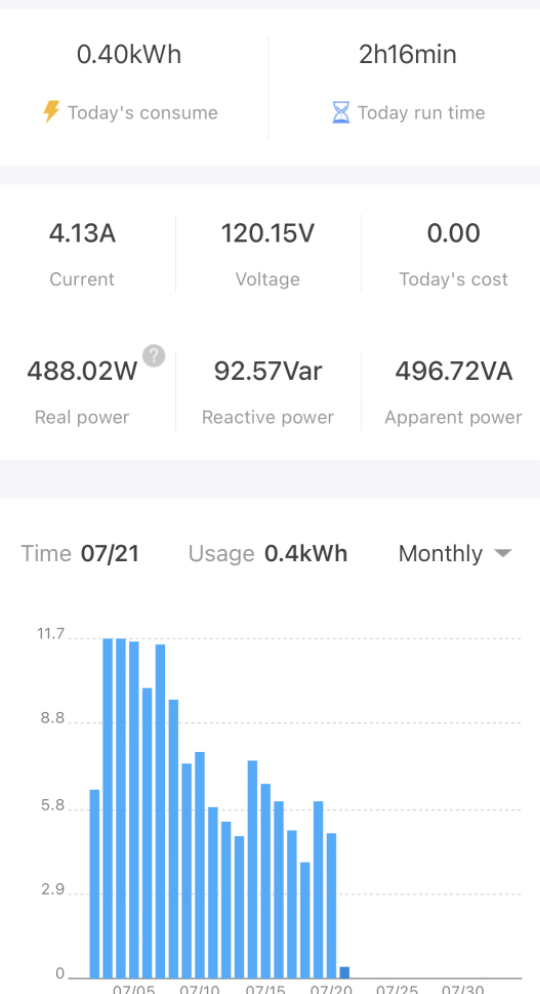
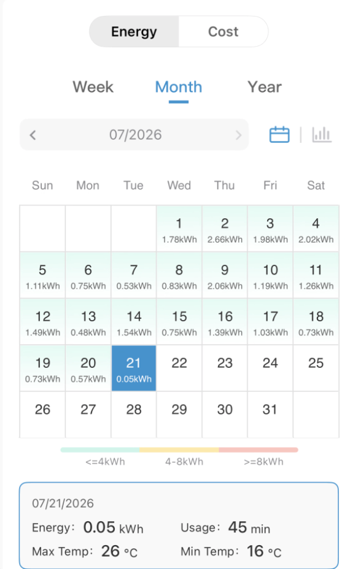
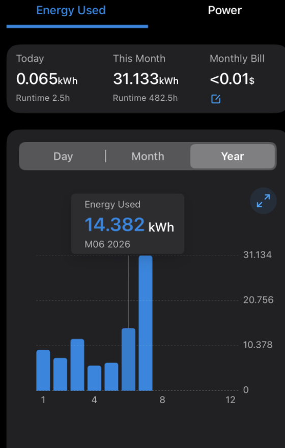
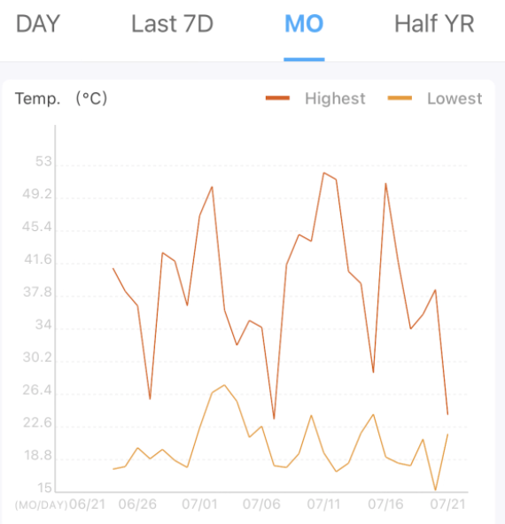

## На вході дано

- центральний кондиціонер
- віконний кондиціонер
- осушувач повітря
- трошки 3Д-принтерів
- холодильник, мікрохвильовка, пралка, лампочки...
- вулична температура близько 30°C
- температура у спальні близько 20°C
<!--more-->

## На виході маємо

- ~1100 спалених кіловат-годин
- рахунок на $400 доларів

## Історичні дані

Минулого року за такий же місяць у квартирі було спожито 1023 квт-год на $367 баксів.

## Табличка

| Показник | Квартира                | Будинок                |
| -------- | ----------------------- | ---------------------- |
| Площа    | 1000 sq ft (~100 кв. м) | 1500 sq ft (~140 кв.м) |
| Кіловат-години | 1023                    | 1067                   |
| Гроші    | 366.89                  | 400.74                 |
| Рік      | 2025                    | 2026                   |
|          |                         |                        |

## Outdoor (Logan) temp

[Logan International Airport Temperature History](https://weatherspark.com/h/m/147265/2026/6/Historical-Weather-in-June-2026-at-Logan-International-Airport-Massachusetts-United-States#Figures-Temperature)

{}
- ### June 2025

  

- ### June 2026

  
{}

## Пристрої

### Центральний кондиціонер

Ніяк не моніториться, немає даних.

### Осушувач

Свої власні дані про споживання не зберігає, спостерігається через смарт-розетку, трошки запізно - не всі дані зібрано.

### Віконний кондиціонер

Сам збирає свою статистику, каже що накрутив 17 квт/год у червні і 25 у липні.

### Принтери

Моніторяться всі разом через розумну розетку, 15+30 квт/год (ще є дві сушилки філаменту) - не дуже багато.

### Сервери

Покищо по технічним причинам вимкнені.

## Висновок

Схоже, що суттєво погода на вулиці не змінилася між 2025 і 2026 роком, а приріст площі в півтора рази не викликав прямо пропорційної зміни у вартості.

До того ж, осушувач повітря - це взагалі новий компонент, який тягне приблизно 500 ватт і накручує від 5 до 10 квт/год на день або в гіршому випадку - третина всього спожитого (300 квт/год на місяць.) Поки що не третина, а лише 150 квт/год, але історичні дані про споживання дещо неповні.

Виходить, хоча сума у цілих 400 баксів виглядає лякаючою, загалом різниця із попередніми періодами невелика, а динаміка ціна/якість (чи ціна/площа) навіть позитивна.

## Бонус

Поклав температурний сенсор у машину, паркується надворі...

