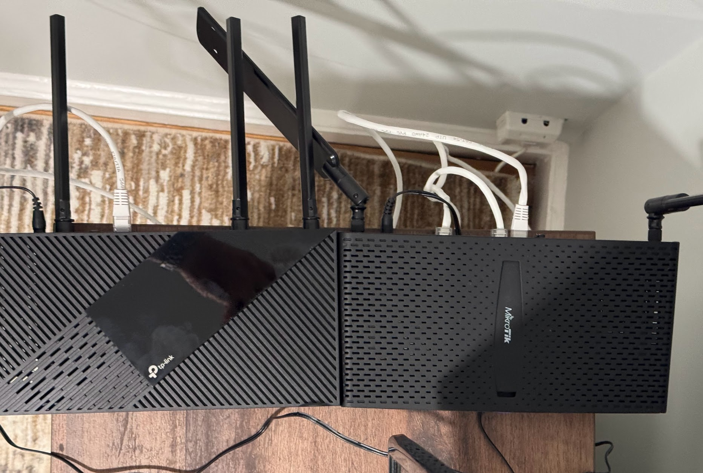

Рішучою рукою просвердлили дірку у підлозі - з першого поверха вниз до підвалу.
<!--more-->

## Що погано

Коробка із обладнанням провайдера прикручена ззовні до стіни будинку. В коробці медіаконвертор, до тої коробки згори спускається оптоволоконний кабель, із підвалу через дірку над вікном підводиться живлення, а від коробки через інші отвори у стінах в дім заводиться коаксіал, два кабелі для домашнього телефону та кабель для інтернету.

Звісно що домашнього телефону нема і скоріше за все не буде, коаксіал для кабельного телебачення у сьогоднішніх реаліях немає сенсу, тому план покращення був наступний:

- прибрати зайві кабелі
- медіаконвертор заховати в підвал
- зняти зі стіни коробку провайдера
- через існуючий отвір у стіні (і фундаменті будинку) завести оптичний кабель до медіаконвертора
- UPT кабелі до роутера і від роутера до інших пристроїв прокласти всередині будинку
- зовнішні кабелі по будинку прибрати
- дірки законопатити

## Що не вийшло

Виявляється що оптичний кабель зі стовба має досить товстий наконечник і в існуючий отвір не пролазить. Консиліум у складі мене та товариша прийняв рішення що розширяти глибоку дірку у товстій стіні зараз недоцільно і ризики не варті потенційних бенефітів, тому пункти про перенос конвертера у підвал і позбуття коробки поки відклалися до кращих часів - можливо, провайдер або хтось зі зварювальним обладнанням зможе кабель розрізати, завести в дірку без необхідності її роздовбування (сам кабель пролазить) і потім заварити, але зараз такої змоги немає.

## Що вийшло

Однак через ту ж дірку, куди не влізла оптика - вже була прокладена вита пара, тому план по заведенню інтернету в дім кращим шляхом вдався. Зайві кабелі від телефону та телебачення прибрали (коаксіал ще треба зняти із будинку), і WAN  від медіаконвертера зайшов не на перший поверх, а у підвал, як і планувалося.

По підвалу проклав два UTP кабелі від одної стіни до іншої - від медіаконвертера до "серверної" та назад, і потім кабель "назад" підключив "угору".

Таким чином

- головний роутер опинився у підвалі, якнайближче до серверів і всі сервери підключилися до нього напряму
- у будинку поставив WIFI6 роутер (у режимі точки доступу) від TP-LINK, який більше року валявся не розпакований

Що сумарно дало певний приріст - у ТП-Лінка 4 антени проти 2 Мікротових, дві я нахилив щоб "дивилися" нагору на другий поверх і тепер із найдальшого кутка SpeedTest наміряє чесні 230-250 Mbps замість 60-90 як було раніше.
Швидкість від ноута до НАСів також "на око" стала більшою, та треба було хоч якось заміряти "до", тепер обʼєктивних даних нема.

