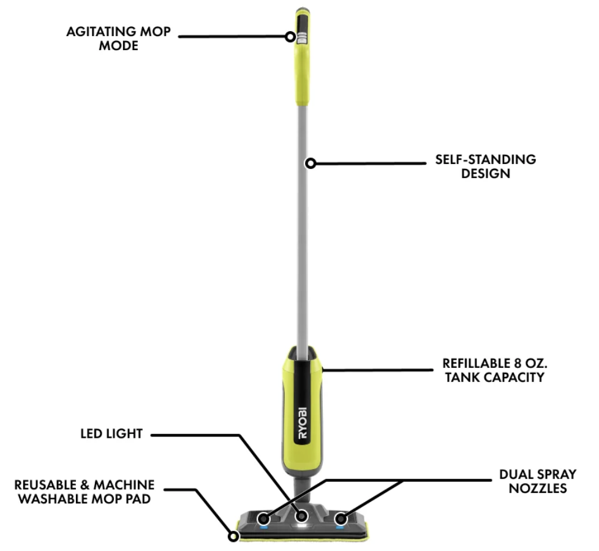

При покупці електроінструменту найбільшу ціну має акумулятор.
<!--more-->

## Інтро

Досить часто вони(інструменти) навіть продаються без батарейки/зарядки - зокрема тому, що в тебе вже може є досить батарейок.

Відповідно, всі ці виробники роблять їх (батарейки, інструменти) максимально несумісними - щоб вже якщо ти підсів на їх "платформу", то не злазив.

## Жовтий

Кілька років тому знижка закинула мене у ["жовту" команду DeWalt](https://www.dewalt.com/en-us/products/power-tools):



Потім якась чергова "знижка" принесла ще дві батарейки



І покотилося...

Пилосос


Насос


Осцилятор (треба було, а він ще і на знижці з батарейкою був...і)


Знову пилосос....

Ой ні, цей не на батарейці, а від розетки - але він класний і тихенький!

## Червоний

Однак із ящиками у Девольта не так класно і їхня Tough System мені не зайшла.
Спочатку я купив самий простенький їх ящик. Він виявився досить практичний і зручний - може слугувати як дуже базовий "козьол" - має в кришці повздовжній паз, куди можна покласти брус щоб відпиляти, а ще на ньому можна сидіти і ставати ногами. Однак чи то на той час чи то в принципі - в систему вони не збиралися, а мені хотілося чогось такого модульного, то ж очевидно що я дочекався якоїсь розпродажі і купив собі набір [Packout](https://www.milwaukeetool.com/products/storage-solutions/packout).



Тепер оце думаю що треба було відразу обирати бандерівську червоно-чорну платформу Milwakee - окрім того, що виглядає бомбічно, вона іще і по всіх показниках обходить абсолютно усіх конкурентів, але,
- а. трохи запізно
- б. не всі інструменти існують на всіх платформах

Наприклад, такого насоса як у Девольт, Мілуокі просто не робить.  
(якогось робить, але він коштує вдвічі дорожче і надуває тільки шини, а матраси не вміє. і схоже не вміє живитися від прикурювача)

Ніяких інструментів червоної команди в мене поки що нема, але ....
АААА, брешу - є !



----


## Зелений

Про те, що Ryobi не розглядають як серйозний інструмент, а лише як іграшки для любителів, [навіть є меми](https://youtube.com/shorts/G2SSVpvhk-E?si=F2eZqyejsDcVrI0Z).

У мене особистий досвід був як я купив якийсь набір біт і розчарувався якістю, тому їх старанно уникав.

Але. Не можна не визнати, що Ryobi робить просто силу силенну інструментів, яких не робить ніхто інший - наприклад, [портативний клеєвий пістолет - на батарейці](https://www.ryobitools.com/products/33287177172)! (ну в сенсі, на їх акумуляторі. тут і скрізь, "батарейка" - це акумулятор, бо  інструментів на AA не буває)  
А воно досить зручно, коли немає шнурка і можна клеїти де хочеться!

Або якісь інструменти, які інші роблять - ліхтарики - але у Райобі вони суттєво дешевші, бо - це ж для любителів )

Коротше кажучи, коли кишеня знов зачухалася, я вирішив що осцилятором розпилювати картонні коробки трошки гучно і незручно, і таки купив собі power cutter





Підманули мене тим, що до нього давали дві бонусні батарейки (разом три!)

І позаяк від цих їхніх літієвих "пальців" живиться [досить широка лінійка інструментів](https://www.ryobitools.com/collections/usb-lithium), я думаю що скоро у зеленій частині мого світлофора нових інструментів додасться.

Існує електрошвабра, матка боска...
