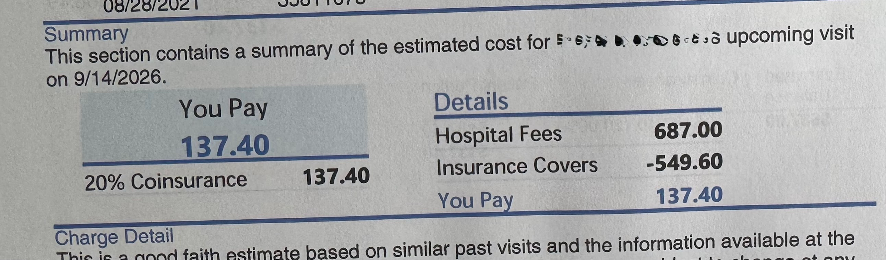

А якщо вам було цікаво, скільки пластир на пальчик коштує, то рахунок вже прибув
<!--more-->

Ми прибули у Emergency Room приблизно о 9й. Позаяк загрози життю немає, то ми почекали хвилин 40 поки нас запросить перша медсестра - поміряє тиск і кисень, визначить вагу і зріст.

Потім ще хвилин 20-30 і завели в кабінет. Друга медсестра запитала ті самі питання, хоча вже нічого не міряла. На лікаря ми чекали ще може із годину. Прийшовши, вона глянула на рану, сходила за матеріалами, принесла якусь хитру пінку (Surgifoam), наклеїла її пластирем і відпустила - витративши на нас може 7 хвилин сумарно.

Нагадую, ми там провели пару годин очікування.

Рахунок:

