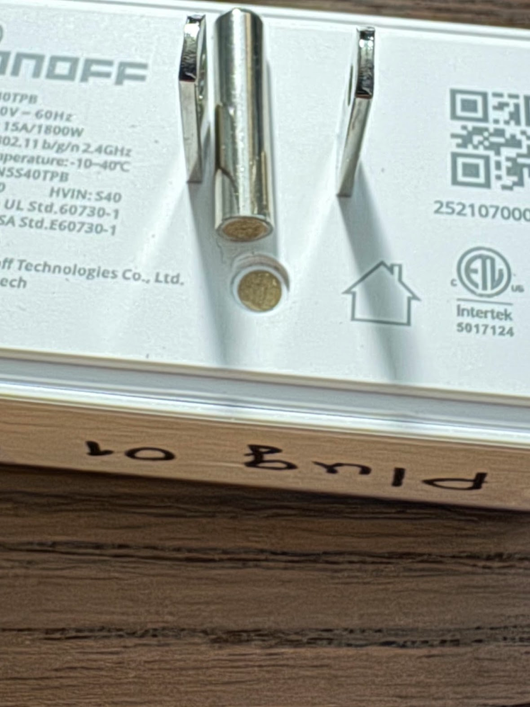
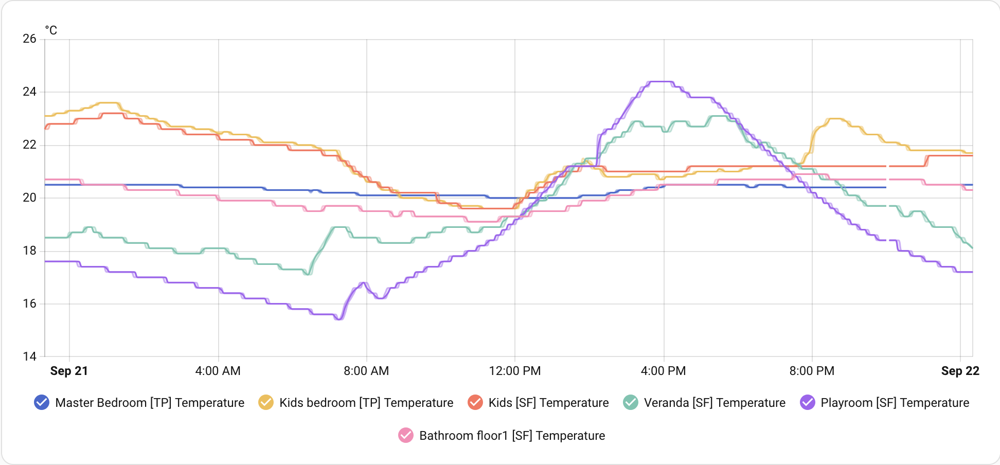

Коли із появою [будинку](/docs/projects/house/) зʼявився якийсь сенс у [розумному будинку](/docs/projects/house/03-smart-home/), я зробив повехневе дослідження "а що взагалі є із доступного"
<!--more-->
На той час у мене вже [було в наявності декілька приблуд](/posts/2025/07/13/tapo-iot/) від китайського TP-LINK він же TAPO, але мене не влаштовувало декілька речей:

- мало кнопок в асортименті - одна єдина кнопка-крутілка
- датчики температури із екраном коштують дорого ($25 за один)
- закритий протокол

## SonOff - початок
Подивився я на Aqara, на SonOFF, та зупинився на останньому. Відкритий протокол Zigbee, датчики із екраном коштують стільки ж як ТП-Лінкові без екрану, є крутецька кнопка із 4 кнопками, кожна із яких підтримує клік, дабл клік, тріпл клік і холд - 16 варіантів у одному пристрої!

І коштує все це супер доступно. Беру, дайте два!

## SonOff - дохлий брідж

Першою неприємністю виявився померлий брідж. Неприємностей це принесло дві:
1. немає міграції пристроїв із бріджа на інший, довелося все перепідключати вручну
2. майже місяць переписувався із техпідтримкою, які чомусь не бачили мої відповіді в пошті, лише нові тікети, але коли я завів третій зі словами "~~осьо унітаз, осьо жопа, давайте вже туалетний папір~~ ну я ж ще у першому повідомленні виклав фото і відео як він не працює" нарешті побачили і прислали новий на заміну.

## SonOff - дохла розетка

Далі одна із розеток виявилася дохлою. Банально не захотіла включатися та підключатися. Тут "пощастило" обійтися без техпідтримки і замовити заміну на Амазон, однак я забув вчасно повернути поламану, тому зняли гроші. Прикро.

## SonOff - поламана розетка

І от власне ламаюча хребет верблюдові соломинка віднайшлася сьогодні - в одній із смарт-розеток - відламалася земля. Причому дуже схоже на фото, що та "земля" то просто фікція - у місці звідки вона відламалася не видно металу (хоча видно такий же коричневий "наповнювач" як і у контакті)

## OFF
Все це сумарно дуже сильно псує враження від бренду та екосистеми. А ще якщо згадати, що апплікуха у них досить бідна та з рекламою - то ще більше.

Включати щось суттєво потужне у такі розетки стрьомно. І звʼязуватися вчергове із жахливою підтримкою теж не дуже хочеться. Кнопки і датчики у некритичних місцях, напевно, можуть попрацювати - але вибір цього провайдера для розумного дому доведеться переосмислити.

## Щось приємне

Щоб не завершувати на мінорній ноті - ось графік із Home Assistant, на якому разом малюються датчики із SonOff та TAPO. (SF - sonoff, TP - tapo)
